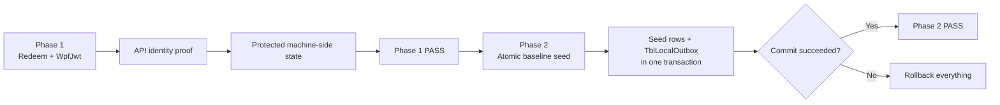

# OBM-POS WPF InstallationV0 — Hợp đồng cài đặt hai Phase

**Trạng thái tài liệu:** Canonical contract cho việc viết mới `InstallationV0`  
**Phạm vi:** WPF InstallationV0 + API thuộc PlatformAppV0  
**Đường dẫn canonical đề nghị:**  
`E:\Project2026\CanonicalInstallationDocs\WPF-INSTALLATION-V0-TWO-PHASE-CONTRACT.md`

---

## 1. Quyết định kiến trúc

Quy trình cài đặt OBM-POS WPF được chia thành đúng **hai phase**:

1. **Phase 1 — API Authorization and Machine-Side Persistence**  
   WPF redeem Pairing Code, nhận `WpfJwt`, dùng chính JWT đó gọi endpoint bảo vệ của `PlatformAppV0`, chứng minh chính xác quyền truy cập API, rồi lưu an toàn các thông số kết nối và credential xuống máy.

2. **Phase 2 — Atomic Local Baseline Seed**  
   Sau khi Phase 1 đã PASS, WPF seed toàn bộ thông số nền vào local POS database trong **một transaction duy nhất**. Cùng transaction đó phải ghi các thay đổi seed tương ứng vào `TblLocalOutbox`. Hoặc tất cả cùng commit, hoặc tất cả cùng rollback.



Hai phase không được trộn với nhau. Phase 1 không được chạm local POS database. Phase 2 không được redeem Pairing Code hoặc phát lại WpfJwt.

---

## 2. Ranh giới source code bắt buộc

### 2.1 WPF

Toàn bộ code cài đặt WPF phải nằm dưới:

```text
E:\Project2026\4POS\NailSalonNet8\InstallationV0
```

Không sử dụng lại code từ các thư mục installation cũ.

### 2.2 Platform UI

Platform administrator UI phải nằm dưới:

```text
E:\Project2026\PlatformAppV0
```

### 2.3 Platform API

Mọi controller, service, authentication, authorization, persistence và test thuộc `PlatformAppV0` phía API phải nằm dưới:

```text
E:\Project2026\1ApiServer\ApiServer01\PlatformAppV0
E:\Project2026\1ApiServer\ApiServer01.Tests\PlatformAppV0
```

Không tạo `PlatformApiV0`, `PlatformV1`, `PlatformV2`, `PlatformV3`, `PlatformProvisioning`, `CanonicalInstallation` hoặc các module cạnh tranh khác.

### 2.4 Visual Studio là quy trình chuẩn

Mọi project phải:

- nằm trong solution Visual Studio canonical;
- build bằng **Build Solution**;
- test được phát hiện trong **Test Explorer**;
- chạy bằng startup project và `launchSettings.json` chuẩn;
- không phụ thuộc vào các script hoặc runtime folder rải rác để phát triển bình thường.

---

# PHASE 1 — API AUTHORIZATION AND MACHINE-SIDE PERSISTENCE

## 3. Mục tiêu Phase 1

Phase 1 trả lời duy nhất câu hỏi:

> WPF trên máy này có được API xác nhận là đúng installation của đúng Tenant và đúng POS station hay không?

Phase 1 chỉ PASS khi **chính process WPF**:

1. redeem Pairing Code thành công;
2. nhận `WpfJwt` có scope giới hạn;
3. dùng `WpfJwt` gọi đúng controller bảo vệ của `PlatformAppV0`;
4. nhận HTTP 200 với success contract xác định;
5. xác minh chính xác scope, Tenant, POS và installation attempt;
6. bảo vệ token xuống máy;
7. đọc token đã bảo vệ trở lại;
8. lưu checkpoint an toàn;
9. đọc checkpoint trở lại;
10. restart và resume mà không redeem lần nữa.

Chỉ nhận được token từ redeem endpoint **không đủ để PASS**.

---

## 4. UI cài đặt mới trong WPF

`InstallationV0` phải có một UI tối thiểu, rõ ràng:

```text
OBM-POS New Installation

API Base URL: <giá trị cấu hình đã được phê duyệt>
Pairing Code: [________________]

[ Redeem and Verify API Access ]
```

UI phải hiển thị từng proof riêng biệt:

```text
Pairing Code redeemed
WpfJwt received
Protected API call succeeded
WpfJwt scope verified
Tenant identity verified
POS identity verified
Installation attempt verified
Credential protected locally
Protected credential readback passed
Machine checkpoint persisted
Restart/resume verified
```

Không được dùng một trạng thái chung chung như `OK`, `Blocked` hoặc `Completed` để thay thế các proof trên.

---

## 5. PlatformAppV0 tạo Pairing Code

Platform administrator chọn:

```text
Tenant -> POS Station -> Create Pairing Code
```

Canonical endpoint đề nghị:

```http
POST /api/platform-v0/tenants/{tenantGuid}/pos-stations/{posStationId}/pairing-codes
```

Controller phải nằm trong source boundary:

```text
E:\Project2026\1ApiServer\ApiServer01\PlatformAppV0\Controllers
```

Pairing Code:

- là one-time code;
- có expiration;
- gắn với đúng `TenantGuid` và `PosStationId`;
- plaintext chỉ được trả về một lần;
- plaintext không được lưu DB;
- plaintext không được log;
- server chỉ lưu normalized HMAC/hash theo thiết kế được duyệt;
- phải hỗ trợ idempotency cho thao tác create.

Success contract phải rõ ràng:

```json
{
  "success": true,
  "resultCode": "PAIRING_CODE_CREATED",
  "pairingAuthorizationGuid": "<guid>",
  "pairingCode": "<one-time-secret>",
  "tenantGuid": "<guid>",
  "tenantCode": "<code>",
  "posStationId": "<guid>",
  "posGuid": "<guid>",
  "posName": "POS1",
  "slotNumber": 1,
  "createdAtUtc": "<utc>",
  "expiresAtUtc": "<utc>"
}
```

---

## 6. WPF redeem Pairing Code

Canonical endpoint đề nghị:

```http
POST /api/platform-v0/wpf/pairing/redeem
```

Redeem action có thể là anonymous ở ASP.NET authentication layer, vì Pairing Code là credential một lần. Tuy nhiên, toàn bộ validation phải diễn ra trong `PlatformAppV0` controller/service.

### 6.1 Request tối thiểu

```json
{
  "pairingCode": "<one-time-code>",
  "clientRequestGuid": "<persistent-guid>",
  "localInstallationGuid": "<machine-installation-guid>",
  "appVersion": "<safe-version>",
  "contractVersion": 1
}
```

`ClientRequestGuid` phải được WPF lưu trước khi gửi request và tái sử dụng khi retry. Timeout không được tạo installation attempt thứ hai.

### 6.2 Server transaction

Server phải xử lý redeem theo transaction:

1. normalize và kiểm tra Pairing Code;
2. kiểm tra trạng thái active, expiration và cancellation;
3. xác minh Tenant/POS station;
4. áp dụng idempotency theo `ClientRequestGuid`;
5. tạo hoặc lấy lại đúng một installation attempt;
6. đánh dấu Pairing Code đã redeem;
7. phát `WpfJwt`;
8. commit;
9. trả response xác định.

### 6.3 Redeem success contract

```json
{
  "success": true,
  "resultCode": "WPF_JWT_ISSUED",
  "credentialType": "Bearer",
  "wpfJwt": "<secret>",
  "scope": "wpf.install.bootstrap",
  "expiresAtUtc": "<utc>",
  "tenantGuid": "<guid>",
  "tenantCode": "<code>",
  "tenantName": "<name>",
  "posStationId": "<guid>",
  "posGuid": "<guid>",
  "posName": "POS1",
  "slotNumber": 1,
  "installationAttemptGuid": "<guid>",
  "attemptVersion": 1,
  "localInstallationGuid": "<guid>",
  "contractVersion": 1
}
```

HTTP 200 nhưng thiếu `success`, sai `resultCode`, thiếu token hoặc thiếu identity phải bị WPF coi là failure.

---

## 7. WpfJwt contract

`WpfJwt` là bootstrap credential giới hạn, không phải Platform administrator token và không phải permanent device credential.

JWT phải có tối thiểu:

```text
iss                     approved PlatformAppV0 issuer
aud                     approved WPF bootstrap audience
scope                   wpf.install.bootstrap
TenantGuid              exact Tenant identity
PosStationId            exact POS station identity
PosGuid                  exact POS runtime identity
InstallationAttemptGuid exact installation attempt
AttemptVersion           current attempt version
LocalInstallationGuid   exact local installation identity
iat                     issued-at
nbf                     not-before
exp                     expiration
jti                     unique token identifier
```

Không được cấp các scope quản trị Platform hoặc scope permanent-device.

Authentication scheme canonical:

```text
WpfJwt
```

Authorization policy canonical:

```text
WpfInstallBootstrap
```

---

## 8. Protected API identity endpoint

Canonical endpoint đề nghị:

```http
GET /api/platform-v0/wpf/bootstrap/me
Authorization: Bearer <WpfJwt>
```

Controller action phải được bảo vệ rõ ràng, ví dụ về mặt contract:

```csharp
[Authorize(
    AuthenticationSchemes = "WpfJwt",
    Policy = "WpfInstallBootstrap")]
```

Không dùng PlatformApp Google cookie để xác thực WPF.

Server phải xác minh:

- JWT signature;
- issuer;
- audience;
- expiration;
- scope;
- TenantGuid;
- PosStationId;
- PosGuid;
- InstallationAttemptGuid;
- AttemptVersion;
- LocalInstallationGuid;
- persisted authorization/attempt state.

Success contract:

```json
{
  "success": true,
  "authenticated": true,
  "resultCode": "WPF_API_IDENTITY_VERIFIED",
  "scope": "wpf.install.bootstrap",
  "tenantGuid": "<guid>",
  "tenantCode": "<code>",
  "tenantName": "<name>",
  "posStationId": "<guid>",
  "posGuid": "<guid>",
  "posName": "POS1",
  "slotNumber": 1,
  "installationAttemptGuid": "<guid>",
  "attemptVersion": 1,
  "localInstallationGuid": "<guid>",
  "credentialExpiresAtUtc": "<utc>",
  "contractVersion": 1
}
```

WPF phải so sánh response này với redeem response. Mọi mismatch đều fail closed.

---

## 9. Lưu an toàn xuống máy

Sau khi `/bootstrap/me` PASS, WPF mới được lưu state.

### 9.1 Secret store

Raw `WpfJwt` phải được bảo vệ bằng `InstallationV0` secret service sử dụng DPAPI hoặc secret owner được phê duyệt.

Raw token không được xuất hiện trong:

- checkpoint JSON;
- log;
- screenshot;
- command line;
- exception message;
- evidence file;
- browser storage;
- source code.

Secret store phải trả về một reference an toàn, ví dụ:

```text
bootstrapCredentialReference = secrets/wpf-bootstrap-v1
```

### 9.2 Machine-side checkpoint

Checkpoint đề nghị:

```json
{
  "checkpointVersion": 1,
  "installationPhase": "ApiAuthorized",
  "apiBaseUrl": "https://<approved-host>",
  "tenantGuid": "<guid>",
  "tenantCode": "<code>",
  "tenantName": "<name>",
  "posStationId": "<guid>",
  "posGuid": "<guid>",
  "posName": "POS1",
  "slotNumber": 1,
  "installationAttemptGuid": "<guid>",
  "attemptVersion": 1,
  "localInstallationGuid": "<guid>",
  "scope": "wpf.install.bootstrap",
  "credentialExpiresAtUtc": "<utc>",
  "bootstrapCredentialReference": "<protected-reference-only>",
  "apiIdentityVerified": true,
  "verifiedAtUtc": "<utc>",
  "contractVersion": 1
}
```

WPF phải thực hiện đúng thứ tự:

1. protect token;
2. read protected token back;
3. validate readback;
4. write checkpoint atomically;
5. read checkpoint back;
6. compare checkpoint identity;
7. mới hiển thị Phase 1 PASS.

Nếu bất kỳ bước nào fail, không được để lại checkpoint `ApiAuthorized` giả.

---

## 10. Restart và resume

Sau Phase 1 PASS:

1. đóng WPF;
2. mở lại cùng WPF và cùng ProductRoot;
3. đọc `ApiAuthorized` checkpoint;
4. resolve và unprotect `WpfJwt`;
5. xác minh checkpoint identity khớp token identity;
6. nếu API reachable, gọi lại `/bootstrap/me`;
7. mở màn hình Phase 2 entry;
8. không hỏi Pairing Code lần nữa;
9. không redeem lần thứ hai;
10. không tạo installation attempt thứ hai.

---

## 11. Phase 1 không được làm

Phase 1 tuyệt đối không được:

- tạo local PostgreSQL database;
- kết nối local POS database;
- apply migration;
- seed settings hoặc business data;
- ghi `TblLocalOutbox`;
- yêu cầu employees, categories, services, customers hoặc gift cards;
- tạo permanent device credential;
- thực hiện PlatformEnrollment;
- đăng ký heartbeat;
- tự động bắt đầu Phase 2.

---

## 12. Phase 1 acceptance proof

Phase 1 chỉ PASS khi có đủ proof:

```text
PairingCodeRedeemed              = true
WpfJwtIssued                     = true
ProtectedApiCallHttp200          = true
ProtectedApiSuccessContract      = true
ScopeVerified                    = true
TenantIdentityVerified           = true
PosStationIdentityVerified       = true
PosGuidVerified                  = true
InstallationAttemptVerified      = true
LocalInstallationGuidVerified    = true
CredentialProtected              = true
ProtectedCredentialReadback      = true
ApiAuthorizedCheckpointPersisted = true
CheckpointReadback               = true
RestartResumeWithoutRedeem       = true
LocalDatabaseTouched             = false
```

Canonical terminal verdict:

```text
PHASE1_WPF_API_AUTHORIZATION_AND_MACHINE_PERSISTENCE_PASS_DATABASE_NOT_STARTED
```

---

# PHASE 2 — ATOMIC LOCAL BASELINE SEED

## 13. Entry condition

Phase 2 chỉ được bắt đầu khi:

```text
Phase1Proof.Valid = true
AND checkpoint.installationPhase = ApiAuthorized
AND protected WpfJwt readback = PASS
AND Tenant/POS/Attempt identity consistency = PASS
```

Phase 2 không được yêu cầu hoặc redeem Pairing Code mới.

---

## 14. Mục tiêu Phase 2

Phase 2 seed toàn bộ **mandatory baseline configuration** của local OBM-POS database trong một transaction duy nhất.

Nguyên tắc bắt buộc:

```text
Seed rows
+ matching TblLocalOutbox rows
+ baseline completion marker
+ runtime activation state, nếu thuộc contract được duyệt

phải cùng COMMIT
hoặc cùng ROLLBACK.
```

Không được để trạng thái:

```text
seed data đã ghi nhưng outbox chưa ghi
```

hoặc:

```text
outbox đã ghi nhưng seed data chưa ghi
```

---

## 15. Baseline seed scope

Baseline manifest được version hóa và dùng stable keys. Tối thiểu có thể gồm:

- application settings bắt buộc;
- system parameters bắt buộc;
- printer/system role defaults;
- default roles như Owner, Admin, SubAdmin nếu đã được operator phê duyệt;
- permission definitions;
- employee-type definitions;
- lookup/system definitions cần thiết để app chạy.

Không thuộc baseline seed mặc định:

- employees/staff;
- service categories;
- services;
- customers;
- gift cards;
- invoices;
- payments;
- bookings;
- queue history;
- payroll transactions.

Những business data này được tạo hoặc import sau.

---

## 16. Single transaction contract

Pseudo-flow bắt buộc:

```text
BEGIN TRANSACTION

1. Validate Phase 1 identity against intended local Tenant/POS identity.
2. Validate baseline manifest version and checksum.
3. Upsert every mandatory seed row by stable key.
4. For every inserted/updated seed row, insert matching TblLocalOutbox row.
5. Write baseline applied/history marker last.
6. Verify required stable keys inside the same transaction.
7. Verify matching TblLocalOutbox entries inside the same transaction.
8. Transition local installation/runtime state if included in approved Phase 2 contract.

COMMIT
```

Failure behavior:

```text
Any failure at steps 1–8
-> ROLLBACK
-> no partial seed rows
-> no partial TblLocalOutbox rows
-> no baseline completion marker
-> no Activated state
```

Không chia từng nhóm seed thành các transaction độc lập.

---

## 17. TblLocalOutbox requirement

Mỗi seed row được insert hoặc update phải có một outbox event tương ứng trong **cùng transaction**.

Outbox row tối thiểu phải có:

```text
OutboxGuid
TenantGuid
SourceClientId
EntityName/TableName
EntityGuid hoặc stable entity key
Operation = I hoặc U
PayloadJson
OccurredAtUtc
Status = Pending
ContractVersion
CorrelationGuid / SeedBatchGuid
```

### 17.1 Quy tắc payload

- payload phải đủ cho canonical API sync consumer;
- không chứa password, token hoặc secret;
- JSON phải deterministic theo contract;
- identity phải đúng Tenant/POS local runtime;
- cùng một `SeedBatchGuid` cho toàn bộ seed transaction.

### 17.2 Idempotency

Lần seed đầu:

- mỗi row mới có một outbox `I`.

Chạy lại cùng baseline version:

- row không đổi: không tạo outbox mới;
- row thay đổi hợp lệ: tạo đúng một outbox `U`;
- không duplicate stable-key rows;
- không duplicate outbox cho cùng logical change.

Nếu baseline version đã hoàn thành và physical readback đúng, Phase 2 phải trả idempotent success.

---

## 18. Physical verification sau commit

Sau COMMIT, WPF phải mở connection mới và đọc lại vật lý:

- baseline version/history;
- tất cả stable keys bắt buộc;
- exact value của từng required row;
- TenantGuid/POS identity;
- `TblLocalOutbox` entries của `SeedBatchGuid`;
- số lượng và key mapping giữa seed rows và outbox rows;
- transaction không để partial state.

Chỉ row count là không đủ; phải kiểm tra theo stable key.

---

## 19. Phase 2 acceptance proof

Phase 2 proof tối thiểu:

```text
Phase1ProofValid                 = true
BaselineManifestVerified         = true
SingleTransactionUsed            = true
RequiredSeedRowsVerified          = true
MatchingTblLocalOutboxVerified    = true
NoPartialSeedState                = true
NoPartialOutboxState              = true
IdempotentSecondRun               = true
PhysicalReadbackPassed            = true
```

Canonical terminal verdict đề nghị:

```text
PHASE2_ATOMIC_BASELINE_SEED_AND_LOCAL_OUTBOX_PASS
```

---

## 20. Failure matrix

| Failure point | Required result |
|---|---|
| Pairing Code invalid/expired | Phase 1 FAIL; không lưu token/checkpoint |
| WpfJwt issued nhưng `/me` fail | Phase 1 FAIL; không tạo `ApiAuthorized` |
| Identity mismatch | Fail closed; không Phase 2 |
| DPAPI protect/readback fail | Phase 1 FAIL |
| Checkpoint write/readback fail | Phase 1 FAIL |
| Restart asks Pairing Code again | Phase 1 FAIL |
| Seed row write fail | Rollback toàn transaction |
| `TblLocalOutbox` insert fail | Rollback toàn transaction |
| Baseline marker write fail | Rollback toàn transaction |
| Physical readback fail | Phase 2 FAIL/RecoveryRequired |
| Second run duplicates rows/outbox | Phase 2 idempotency FAIL |

---

## 21. Module ownership

| Trách nhiệm | Owner bắt buộc |
|---|---|
| WPF New Installation UI | `InstallationV0` |
| WPF redeem coordinator | `InstallationV0` |
| WPF WpfJwt secure storage | `InstallationV0` |
| WPF checkpoint/restart resume | `InstallationV0` |
| Admin Pairing Code UI | standalone `PlatformAppV0` |
| Pairing Code controller/service | ApiServer `PlatformAppV0` |
| WpfJwt issuance/validation | ApiServer `PlatformAppV0` |
| Protected `/bootstrap/me` | ApiServer `PlatformAppV0` |
| Local baseline seed | `InstallationV0` Phase 2 |
| `TblLocalOutbox` writes | `InstallationV0` Phase 2, same transaction |

Presentation code không được trực tiếp tự viết secret, SQL, token validation hoặc transaction logic.

---

## 22. Implementation order

### Cluster 1 — Empty contracts

- define request/response/problem contracts;
- define exact result codes;
- add contract tests.

### Cluster 2 — PlatformAppV0 API Phase 1

- create Pairing Code;
- redeem;
- issue `WpfJwt`;
- configure `WpfJwt` scheme/policy;
- implement protected `/bootstrap/me`;
- API tests.

### Cluster 3 — PlatformAppV0 admin UI

- Tenant/POS selection;
- one-time Pairing Code display;
- no business-data gate.

### Cluster 4 — WPF InstallationV0 Phase 1

- New Installation UI;
- redeem;
- protected `/me` call;
- exact identity comparison;
- DPAPI;
- checkpoint;
- restart/resume;
- no DB access.

### Cluster 5 — Physical Phase 1 acceptance

- one clean ProductRoot;
- one code;
- one attempt;
- WPF physical proof;
- restart proof.

### Cluster 6 — Phase 2 design/implementation

Chỉ bắt đầu sau khi Phase 1 verdict PASS. Implement atomic baseline seed và `TblLocalOutbox` trong cùng transaction.

---

## 23. Final canonical rules

```text
Phase 1 proves that this WPF installation is authorized to use the API as one
exact Tenant/POS/InstallationAttempt and persists that proof securely on the
machine.

Phase 2 seeds the mandatory local baseline and its TblLocalOutbox records in one
atomic transaction.

No token-only success.
No generic HTTP 200 success.
No partial seed.
No seed without outbox.
No outbox without seed.
No old installation implementation may be reused.
```
