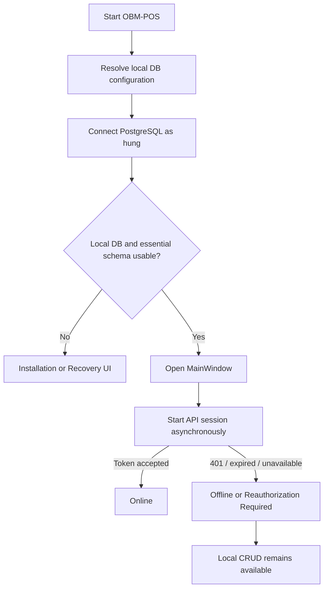
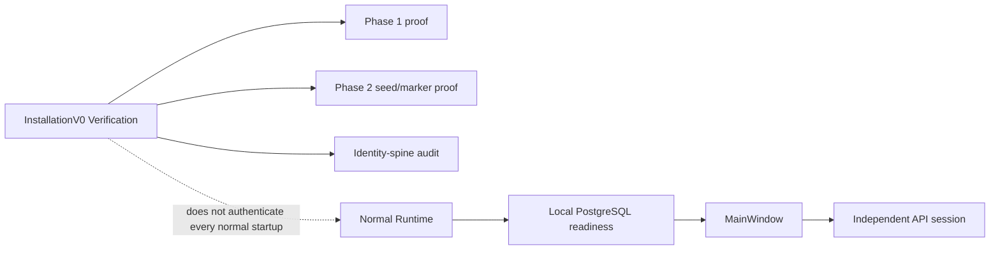

# Prompt 053 — Rewrite the canonical startup documentation, enforce a Codex read-before-code gate, and finish service-name cleanup

## Operator decision

The runtime behavior has now been simplified, but the repository still contains misleading historical service/type/file names and competing documentation. Those traces can cause a future developer or AI agent to recreate an unnecessary password/bootstrap/security architecture.

This prompt has two priorities, in this exact order:

```text
1. Documentation first — establish one current canonical authority and a mandatory read-before-code gate.
2. Naming cleanup — make active class names, interface names, file names, DI registrations, tests, comments, and documentation match the simplified architecture.
```

Do not edit implementation source before completing and recording the documentation gate described below.

## Read first

Read completely:

```text
report/report044.md
report/report045.md
report/report049.md
report/report050.md
report/report051.md
report/report052.md
```

Then inspect all current/historical installation and runtime documentation, including at minimum:

```text
E:\Project2026\4POS\NailSalonNet8\docs\refactoryInstallation\INSTALLATION_RUNTIME_CANONICAL.md
E:\Project2026\4POS\NailSalonNet8\docs\refactoryInstallation\CURRENT_TASK.md
E:\Project2026\4POS\NailSalonNet8\docs\refactoryInstallation\CURRENT_RESULT.md
E:\Project2026\CanonicalInstallationDocs\WPF-INSTALLATION-V0-TWO-PHASE-CONTRACT.md
E:\Project2026\4POS\NailSalonNet8\AGENTS.md   (if present)
```

Discover other documents that claim to be current architecture authorities. Do not create a second competing architecture authority.

## Phase A — mandatory documentation gate before source edits

Before changing any `.cs`, `.xaml`, `.csproj`, launch profile, DI registration, or test file:

1. Record the exact canonical-document paths found.
2. Record SHA-256 hashes and version/header information for the current documents.
3. Identify contradictions, obsolete service names, obsolete route names, and documents that still present API/bootstrap proof as normal POS startup authentication.
4. Preserve the prior current canonical document in a versioned history folder before replacing its contents.
5. Rewrite the current canonical documentation.
6. Add/update the repository `AGENTS.md` read-before-code instructions.
7. Only after this documentation work is complete may source naming cleanup begin.

The report must include a gate result:

```text
DOCS_READ_BEFORE_CODE_GATE=PASS
```

with the document versions/hashes read before the first implementation edit.

If the canonical documents are missing or cannot be preserved safely, stop before code edits with:

```text
BLOCKED_CANONICAL_DOCUMENTATION_GATE
```

## One current canonical authority

Use this as the current authority:

```text
E:\Project2026\4POS\NailSalonNet8\docs\refactoryInstallation\INSTALLATION_RUNTIME_CANONICAL.md
```

Requirements:

- Preserve the previous contents first under a versioned history folder, for example:

```text
E:\Project2026\4POS\NailSalonNet8\docs\refactoryInstallation\history\V001\INSTALLATION_RUNTIME_CANONICAL_V001.md
```

Use the next available version; do not overwrite an existing history version.

- The current `INSTALLATION_RUNTIME_CANONICAL.md` remains the only current architecture authority.
- Historical documents must be marked `Historical`, `Superseded`, or `Evidence Only` and must point to the current canonical document.
- Do not delete historical evidence automatically.
- Update `CURRENT_TASK.md` and `CURRENT_RESULT.md` to reference the current canonical version and the current service names.

## Canonical architecture that must be documented

The rewritten canonical document must make the normal runtime understandable in a few lines:

```text
Local PostgreSQL usable
-> open MainWindow
-> initialize API session afterward

API token valid
-> Online

API token expired / HTTP 401 / API unavailable
-> MainWindow remains open
-> local CRUD continues
-> API is Offline or Reauthorization Required
```

### Local runtime credential

Document precisely:

```text
Database = obm_pos_dev_v0_pg
Runtime PostgreSQL username = hung
Password = protected local PostgreSQL password
```

The PostgreSQL password is infrastructure authentication only. It is not an employee password.

The `postgres` administrator role is provisioning/migration/backup-only, not the intended daily POS runtime role.

### Employee operational PIN

Document precisely:

```text
TblEmployee.LoginNumber = employee operational PIN
```

Purpose:

```text
local Staff/non-Staff UI gating
manager-area access
actor attribution
audit/log correlation
```

It is not:

```text
application account password
PostgreSQL credential
API credential
device authorization
installation proof
startup credential
```

Approved policy remains:

```text
Staff PIN = 4 digits
Non-Staff PIN = 6 digits
```

Current implementation gaps may be documented, but do not create a password framework in this prompt.

### API session

Document that API access is independent and occurs after MainWindow is visible. Current refresh-token work remains deferred.

### Installation verification

Document that Phase 1, Phase 2, markers, seed counts, identity-spine checks, and protected hello are installation/verification concerns. They are not ordinary local runtime authentication.

## Required canonical diagrams

Include at least these Mermaid diagrams in `INSTALLATION_RUNTIME_CANONICAL.md`.

### Normal runtime



### Installation versus runtime



## Root `AGENTS.md` read-before-code gate

Create or update:

```text
E:\Project2026\4POS\NailSalonNet8\AGENTS.md
```

This file is a pointer/instruction file, not a second architecture authority.

It must require every Codex task that changes startup, installation, DB connectivity, API auth/session, employee PIN, runtime state, or MainWindow routing to read these files before source edits:

```text
docs\refactoryInstallation\INSTALLATION_RUNTIME_CANONICAL.md
docs\refactoryInstallation\CURRENT_TASK.md
docs\refactoryInstallation\CURRENT_RESULT.md
```

It must require the implementation report to contain:

```text
DOCS_READ_BEFORE_CODE_GATE=PASS
CanonicalDocVersion=<version>
CanonicalDocSha256=<hash>
```

It must state:

```text
- do not create another current architecture authority;
- do not use historical/superseded docs as current requirements;
- do not reintroduce API/bootstrap/token/PIN checks before MainWindow;
- do not use generic “password” for employee LoginNumber;
- use the current service/type names defined in the canonical document;
- update canonical docs first when architecture or service names change.
```

## Current service naming from report052

Report052 introduced or activated these names:

```text
LocalPosStartupService
LocalPosStartupResult / equivalent local-only result
IApiSessionInitializer
ApiSessionInitializer
InstallationV0VerificationService (required final installer/audit name)
```

Report052 still retained compatibility names and mismatched physical file names. This prompt must finish the cleanup where safely possible.

## Phase B — source/service/file naming cleanup

After `DOCS_READ_BEFORE_CODE_GATE=PASS`, audit every reference, DI registration, factory, test, reflection/XAML use, and file name for the following symbols.

### Old normal-startup names to remove

```text
ApplicationStartupCoordinator
DatabaseStartupAssessmentService
DatabaseStartupAssessment
DatabaseStartupMode
InstalledHealthy
BootstrapRepairRequired
POS_RUNTIME_ROUTE_BOOTSTRAPREPAIRREQUIRED
RepairBootstrap
NeedsBootstrapRepair
```

### Old API-session names to remove

```text
AppJwtBootstrapper
IAppJwtBootstrapper
```

### Old installation-verification name to remove

```text
InstallationV0CompletedReadinessService
```

### Other ambiguous names to audit

```text
RuntimeProfileStartupAssessmentService
LaunchProvenanceContext
EffectiveProductRootContext
```

Rules:

- If an ambiguous type has no required active caller, delete it.
- If it is Development-only safety, rename it so `Development` and `Safety` are explicit and document that it is not runtime authentication.
- Do not retain compatibility shims solely for internal tests. Update the tests and delete the shim.
- Keep a shim only when a proven external/public binary contract requires it; report the evidence.
- No generic `BootstrapRepair` wording may remain in the active normal-runtime path.

## Required final names and physical file names

Prefer this final naming, adjusting only when source evidence requires a very small variation:

```text
LocalPosStartupService.cs
LocalPosStartupResult.cs
LocalPosStartupDecision.cs
IApiSessionInitializer.cs
ApiSessionInitializer.cs
InstallationV0VerificationService.cs
```

The public type name and physical source file name must match.

Examples of mismatches from report052 that must be corrected:

```text
ConnectService\AppJwtBootstrapper.cs containing ApiSessionInitializer
ConnectService\IAppJwtBootstrapper.cs containing IApiSessionInitializer
Services\Startup\DatabaseStartupAssessmentService.cs containing LocalPosStartupService
```

Rename/move the files and update project references. Do not leave the old file names behind.

## Final runtime code shape

The active normal startup should be obvious:

```csharp
var localResult = await localPosStartupService.StartAsync();

if (localResult.IsReady)
{
    await ShowMainWindowAsync();
    _ = apiSessionInitializer.StartAsync();
    return;
}

ShowInstallationOrRecovery(localResult);
```

No API call, protected hello, Pairing Code check, employee PIN check, Phase 1 check, Phase 2 count check, or installation-verification service call may occur before the MainWindow decision when local PostgreSQL is usable.

## Canonical terminology guard

Add a focused test or repository check that scans active source and current canonical docs, excluding history/archive/migrations/reports, and fails on forbidden active names such as:

```text
ApplicationStartupCoordinator
DatabaseStartupAssessmentService
AppJwtBootstrapper
IAppJwtBootstrapper
InstallationV0CompletedReadinessService
POS_RUNTIME_ROUTE_BOOTSTRAPREPAIRREQUIRED
BootstrapRepairRequired
```

The guard must not fail on preserved historical documents under the versioned history/archive folders.

The guard should also prevent the phrase `employee password` in current canonical docs; use `employee operational PIN`.

## No behavior expansion

This prompt is documentation and semantic cleanup. Do not add new startup behavior or new security layers.

Do not:

```text
- mutate PostgreSQL;
- run seed/migrations;
- change DB roles/passwords;
- redeem Pairing Code;
- implement refresh tokens;
- change employee PIN values or validation rules;
- drop ASP.NET Identity tables;
- migrate outbox data;
- set User/Machine environment variables.
```

The active behavior must remain:

```text
local DB usable -> MainWindow
API failure -> offline/reauthorization only
```

## Builds and tests

After documentation and naming cleanup, run:

```text
dotnet build E:\Project2026\4POS\NailSalonNet8\InstallationV0\InstallationV0.csproj -v minimal

dotnet build E:\Project2026\4POS\NailSalonNet8\NailSalonNet8.csproj -v minimal

dotnet test E:\Project2026\4POS\NailSalonNet8.Tests\NailSalonNet8.Tests.csproj --filter "FullyQualifiedName~InstallationV0|FullyQualifiedName~Startup|FullyQualifiedName~MainWindow|FullyQualifiedName~Offline|FullyQualifiedName~Database|FullyQualifiedName~Naming|FullyQualifiedName~Documentation" -v minimal
```

## Build label

If InstallationV0 source changes, set:

```text
Build label: prompt053
Window title: OBM InstallationV0 Phase 1/2 - prompt053
```

## Report 053

Create and push:

```text
report/report053.md
```

Required sections:

1. Verdict.
2. `DOCS_READ_BEFORE_CODE_GATE` evidence with paths, versions, hashes, and timestamp/order proving docs were updated before source edits.
3. Canonical-document contradiction inventory.
4. Previous canonical version preservation path and checksum.
5. Rewritten canonical version and checksum.
6. `AGENTS.md` mandatory read-before-code rules.
7. Current canonical architecture summary.
8. Old-name to final-name table.
9. Files/classes/interfaces/DI registrations deleted.
10. Files/classes/interfaces renamed or moved.
11. Compatibility shims retained, with proven reason; expected normally none.
12. Naming/terminology guard implementation.
13. Exact source and documentation files changed.
14. Build/test commands and counts.
15. Proof behavior did not expand or change DB/API/PIN contracts.
16. Prompt053 label proof if applicable.
17. No secrets/no DB mutation/no source push proof.
18. Coordination commit SHA.

## Valid verdicts

```text
OBM_POS_CANONICAL_DOCS_AND_SERVICE_NAMES_READY_FOR_USER_RETEST
```

```text
BLOCKED_CANONICAL_DOCUMENTATION_GATE
```

```text
BLOCKED_SERVICE_NAMING_CLEANUP_EXTERNAL_CONTRACT
```
