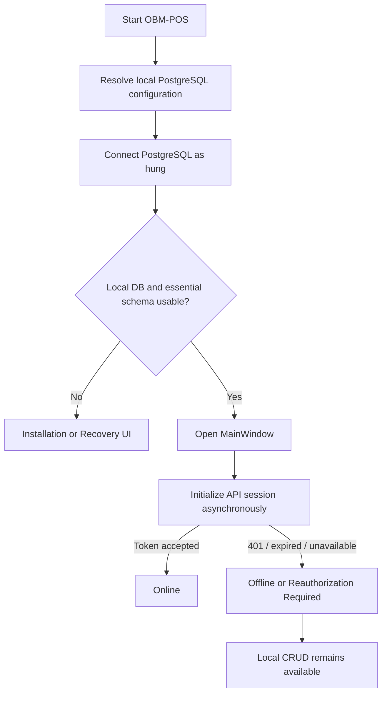
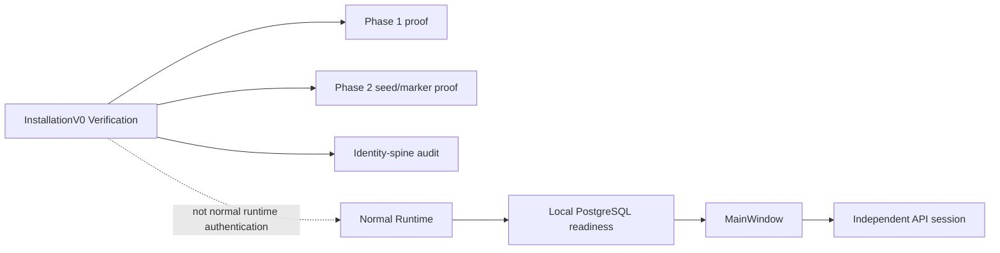
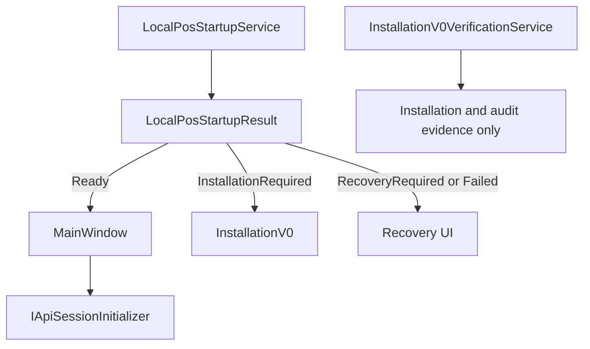

# Prompt 055 — Create the first canonical Installation/Runtime V001 documentation and mandatory Codex read-before-code gate

## Operator decision

The dependency-graph audit is complete:

```text
report/report054.md
Verdict: INSTALLATION_DEPENDENCY_GRAPH_AUDIT_READY_FOR_CANONICAL_V001
```

Graphify and source-level inspection proved the current architectural boundary:

```text
Local PostgreSQL usability decides whether MainWindow may open.
API/session initialization is post-MainWindow.
Phase 1/Phase 2 proof belongs to installation/verification, not normal runtime authentication.
Employee LoginNumber is an operational PIN, not an application password or startup credential.
```

The prior prompt053 was blocked because the intended canonical files never existed. Therefore this prompt creates the **first canonical V001**. There is no prior canonical file at that path to archive.

This prompt is **documentation-only**.

Do not edit implementation source, tests, project files, launch profiles, DI registrations, database configuration, PostgreSQL, API state, employee PINs, tokens, or running processes.

Source/service renaming and deletion will occur in a later prompt after this gate is physically present.

## Read first

Read completely:

```text
report/report044.md
report/report045.md
report/report049.md
report/report050.md
report/report051.md
report/report052.md
report/report053.md
report/report054.md
```

Read the versioned audit evidence:

```text
E:\Project2026\RecoveryReports\InstallationV0\DependencyGraphAuditV001\README.md
E:\Project2026\RecoveryReports\InstallationV0\DependencyGraphAuditV001\SHA256SUMS.txt
E:\Project2026\RecoveryReports\InstallationV0\DependencyGraphAuditV001\installation-flow-current.mmd
E:\Project2026\RecoveryReports\InstallationV0\DependencyGraphAuditV001\installation-flow-target.mmd
E:\Project2026\RecoveryReports\InstallationV0\DependencyGraphAuditV001\installation-flow-subgraph.json
E:\Project2026\RecoveryReports\InstallationV0\DependencyGraphAuditV001\edge-inventory.csv
E:\Project2026\RecoveryReports\InstallationV0\DependencyGraphAuditV001\symbol-action-inventory.csv
E:\Project2026\RecoveryReports\InstallationV0\DependencyGraphAuditV001\redundant-link-candidates.md
E:\Project2026\RecoveryReports\InstallationV0\DependencyGraphAuditV001\dynamic-edge-checklist.md
E:\Project2026\RecoveryReports\InstallationV0\DependencyGraphAuditV001\aspnet-identity-trace-audit.md
```

Also inspect existing relevant documents:

```text
E:\Project2026\CanonicalInstallationDocs\WPF-INSTALLATION-V0-TWO-PHASE-CONTRACT.md
E:\Project2026\4POS\NailSalonNet8\docs\wpfsummary.md
```

Do not treat those older documents as the new runtime authority. They are evidence/historical material.

## Documentation gate before mutation

Before creating files, record sanitized evidence:

```text
- all required reports/evidence paths read;
- SHA-256 of report054 and DependencyGraphAuditV001/SHA256SUMS.txt;
- Graphify version from report054;
- confirmation that docs\refactoryInstallation does not currently exist or contains no canonical V001;
- confirmation that no previous INSTALLATION_RUNTIME_CANONICAL.md exists at the target path.
```

Gate result required in report055:

```text
DOCS_READ_BEFORE_CODE_GATE=PASS
CanonicalDocVersion=V001
```

Because no previous canonical file exists, record:

```text
PreviousCanonicalVersion=None
CanonicalCreationMode=FirstVersion
```

Do not invent or copy a fake V000/V001 history file.

## Create the canonical documentation folder

Create:

```text
E:\Project2026\4POS\NailSalonNet8\docs\refactoryInstallation\
```

Create these current files:

```text
INSTALLATION_RUNTIME_CANONICAL.md
CURRENT_TASK.md
CURRENT_RESULT.md
README.md
```

Create the repository instruction file:

```text
E:\Project2026\4POS\NailSalonNet8\AGENTS.md
```

Do not create another current architecture authority elsewhere.

## 1. INSTALLATION_RUNTIME_CANONICAL.md — V001

Header requirements:

```text
Title: OBM-POS Installation and Runtime Canonical Contract
Version: V001
Status: Current Canonical Authority
Effective date/time
Evidence basis: report044–report054 and DependencyGraphAuditV001
```

Include SHA-256/version metadata near the end after writing and hashing. If self-hashing would change the file, record the final hash in CURRENT_RESULT.md and report055 rather than embedding an unstable self-hash.

### Canonical normal-runtime rule

State exactly:

```text
Local PostgreSQL usable
-> open MainWindow
-> initialize API session afterward

API token valid
-> Online

API token expired / HTTP 401 / API unavailable
-> MainWindow remains open
-> local CRUD continues
-> API is Offline or Reauthorization Required
```

### Local PostgreSQL credential boundary

Document:

```text
Development database: obm_pos_dev_v0_pg
Normal runtime PostgreSQL username: hung
Password: protected local PostgreSQL password
```

Clarify:

```text
- PostgreSQL username/password is infrastructure authentication.
- It is not an employee password.
- postgres is provisioning/migration/backup-only, not intended daily POS runtime identity.
- ordinary local CRUD must not depend on API token, Pairing Code, employee PIN, Phase proof counts, or launch provenance.
```

Do not print the actual password or a connection string.

### Employee operational PIN boundary

Document:

```text
TblEmployee.LoginNumber = employee operational PIN
```

Purpose:

```text
- local Staff/non-Staff UI gating;
- manager-area/sensitive-action access;
- actor attribution;
- audit/log correlation.
```

It is not:

```text
- application account password;
- PostgreSQL credential;
- API credential;
- device authorization;
- installation proof;
- startup credential.
```

Approved policy:

```text
Staff PIN = exactly 4 digits
Non-Staff PIN = exactly 6 digits
```

Document current implementation gaps as deferred work; do not imply they are already fixed.

### API session boundary

Document:

```text
- API session starts only after MainWindow is visible.
- Current WpfJwt/Phase 1 token is installation/bootstrap evidence, not the final refresh-token runtime lifecycle.
- HTTP 401 means Offline/Reauthorization Required, not local installation failure.
- Access-token + refresh-token implementation is deferred.
```

### Installation verification boundary

Document that these are installation/verification concerns only:

```text
Phase 1 authorization/checkpoint/protected hello
Phase 2 seed and completion marker
identity-spine audit
exact employee/permission/outbox proof
marker-last transaction proof
InstallationV0 verification UI
```

They may be used for:

```text
initial installation
installation resume
upgrade verification
recovery/audit
API reauthorization
```

They must not authenticate every normal runtime startup.

### Current dependency graph conclusions

Summarize source-backed conclusions from report054:

```text
- direct runtime path uses LocalPosStartupService before MainWindow;
- InstallationV0 Open OBM-POS should reuse the same local startup path;
- IApiSessionInitializer is post-MainWindow;
- compatibility and ambiguous names remain and are scheduled for cleanup;
- no hidden API/PIN/Phase-proof pre-MainWindow dependency was proven by static audit;
- dynamic/reflection absence is not absolute proof, so naming cleanup must preserve focused tests.
```

### Current and prohibited service names

Define the target current names for future source cleanup:

```text
LocalPosStartupService
LocalPosStartupResult
LocalPosStartupDecision
IApiSessionInitializer
ApiSessionInitializer
InstallationV0VerificationService
```

Mark these old names as prohibited for new active code:

```text
ApplicationStartupCoordinator
DatabaseStartupAssessmentService
DatabaseStartupAssessment
DatabaseStartupMode
AppJwtBootstrapper
IAppJwtBootstrapper
InstallationV0CompletedReadinessService
BootstrapRepairRequired
POS_RUNTIME_ROUTE_BOOTSTRAPREPAIRREQUIRED
RepairBootstrap
NeedsBootstrapRepair
```

Classify these names as audit-required before deletion/rename:

```text
RuntimeProfileStartupAssessmentService
LaunchProvenanceContext
EffectiveProductRootContext
```

State that Development-only safety names must explicitly contain `Development` and `Safety` and are not runtime authentication.

### ASP.NET Identity boundary

Document the report054 conclusion:

```text
ASP.NET Identity tables/types were not proven to be ordinary WPF pre-MainWindow runtime dependencies.
```

State that removal requires a later source/migration/DB dependency cleanup prompt after physical MainWindow/local CRUD acceptance. Do not declare them deleted.

### Required Mermaid diagrams

Include these diagrams.

#### Normal runtime



#### Installation versus runtime



#### Naming cleanup target



## 2. README.md

Create a concise folder index:

```text
INSTALLATION_RUNTIME_CANONICAL.md = only current authority
CURRENT_TASK.md = current approved next implementation task
CURRENT_RESULT.md = latest completed canonical/documentation result
history/ = future preserved superseded canonical versions
```

State that historical evidence elsewhere does not override the current canonical file.

Do not create a history/V001 copy because V001 is the first canonical version. Create the empty `history` folder only if needed by repository conventions; do not create fake history content.

## 3. CURRENT_TASK.md

Set the next approved task to:

```text
Service/type/file naming cleanup based on DependencyGraphAuditV001 and canonical V001.
```

Required scope:

```text
- remove compatibility aliases where there is no external contract;
- rename physical files to match public types;
- update DI registrations and tests;
- remove generic BootstrapRepair wording from active normal runtime;
- keep behavior unchanged;
- no DB/API/PIN contract changes;
- physical MainWindow retest after cleanup.
```

Include an explicit pre-code requirement:

```text
Read INSTALLATION_RUNTIME_CANONICAL.md V001 and verify SHA-256 before editing source.
```

## 4. CURRENT_RESULT.md

Record:

```text
- DependencyGraphAuditV001 completed;
- Canonical V001 created;
- AGENTS.md gate created;
- source naming cleanup not yet performed;
- no DB mutation;
- no WPF launch;
- next task is naming cleanup.
```

Include final hashes for:

```text
INSTALLATION_RUNTIME_CANONICAL.md
CURRENT_TASK.md
CURRENT_RESULT.md
README.md
AGENTS.md
```

## 5. AGENTS.md — mandatory read-before-code gate

Create/update:

```text
E:\Project2026\4POS\NailSalonNet8\AGENTS.md
```

This is an instruction pointer, not another architecture authority.

It must require any AI/Codex task changing any of the following to read the canonical docs first:

```text
startup
installation
DB connectivity
runtime DB role/credential source
API auth/session
employee operational PIN
runtime state
MainWindow routing
service/type naming in these flows
ASP.NET Identity cleanup
```

Mandatory read list:

```text
docs\refactoryInstallation\INSTALLATION_RUNTIME_CANONICAL.md
docs\refactoryInstallation\CURRENT_TASK.md
docs\refactoryInstallation\CURRENT_RESULT.md
```

Every implementation report must contain:

```text
DOCS_READ_BEFORE_CODE_GATE=PASS
CanonicalDocVersion=V001
CanonicalDocSha256=<actual hash>
```

Rules:

```text
- do not create another current architecture authority;
- historical/superseded/evidence documents do not override V001;
- update canonical docs first when architecture/service names change;
- local PostgreSQL usability decides MainWindow route;
- API/token/Pairing Code/PIN/Phase proof must not gate MainWindow when local DB is usable;
- use employee operational PIN, not employee password;
- use current canonical service names;
- do not retain compatibility shims without proven external contract;
- Graphify/static absence alone is not deletion proof; check DI/XAML/reflection/config/tests.
```

## Existing older documents

Do not rewrite their full historical content in this prompt.

Add a concise current-status notice at the top of these documents only when safe:

```text
E:\Project2026\CanonicalInstallationDocs\WPF-INSTALLATION-V0-TWO-PHASE-CONTRACT.md
E:\Project2026\4POS\NailSalonNet8\docs\wpfsummary.md
```

Required notice:

```text
Status: Evidence Only / Superseded for current runtime architecture.
Current authority: docs\refactoryInstallation\INSTALLATION_RUNTIME_CANONICAL.md V001.
```

Preserve the original body. Do not delete it.

If those files are outside the intended mutation scope or already modified in ways that make a safe header insertion uncertain, leave them unchanged and record the limitation in report055. The new canonical file still becomes the only authority via AGENTS.md.

## Safety and no-code rule

This prompt must not modify:

```text
*.cs
*.xaml
*.csproj
*.sln
launchSettings.json
DI registrations
tests
PostgreSQL
API contracts/tokens
employee PIN values/rules
environment variables
running processes
```

Do not build or test implementation because no source code changes are allowed.

You may run documentation checks, Markdown link checks, JSON/Mermaid syntax checks, hashes, and repository status commands.

## Verification

Verify:

```text
- all five current documentation/instruction files exist;
- V001 is the only current canonical authority;
- AGENTS.md points to it;
- CURRENT_TASK/RESULT point to V001;
- Mermaid code blocks are syntactically complete;
- forbidden active terminology is absent from current canonical docs except inside an explicitly labeled prohibited-name table;
- no implementation source changed by this prompt;
- no DB/process mutation occurred.
```

## Report 055

Create and push:

```text
report/report055.md
```

Required sections:

1. Verdict.
2. `DOCS_READ_BEFORE_CODE_GATE` evidence and read order.
3. Graphify/audit evidence hashes used.
4. Confirmation this is `CanonicalCreationMode=FirstVersion` and no fake prior archive was created.
5. Files/folders created.
6. Canonical V001 full outline and authority statement.
7. Mermaid diagram validation.
8. `AGENTS.md` mandatory gate rules.
9. CURRENT_TASK and CURRENT_RESULT contents/intent.
10. Older-document status notices added or limitations.
11. Final SHA-256 table for current docs.
12. Proof no implementation source/tests/config changed.
13. Proof no DB/API/PIN/process mutation.
14. Coordination commit SHA.

## Valid verdicts

```text
OBM_POS_CANONICAL_V001_AND_CODE_GATE_READY
```

```text
BLOCKED_CANONICAL_V001_CREATION
```
