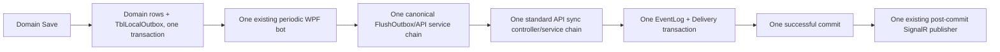

# Prompt 110 — Audit and consolidate transaction-group semantics into the single canonical WPF/API sync pipeline

## Starting checkpoint

Report109 passed with:

```text
OBM_LEGACY_FIREBASE_USER_SECRET_REMOVED_WPFJWT_CANONICAL_READY_FOR_SYNC_FLOW_AUDIT
```

Coordination references:

```text
report/report108.md
report108 commit: 3e09392d3b86304b92b3b6d4219d80172c5796fd
prompt108 private artifact aggregate SHA-256:
e9d8298486f31f40581cb4445fa0abac25030bd586303098c05e1a9225f0d0ea

report/report109.md
report109 commit: ef80748505cefe0768093ceffab7dadb4f0788de
prompt109 private artifact aggregate SHA-256:
b97b2eaed1738c497502c92b057c5133bf6b20345d302b3daea44541d0012dfa
```

Accepted database/auth anchors now are:

```text
WPF Development DB:
- reset/recreated UTF8
- migrated from zero
- pending migrations = 0
- grouped TblLocalOutbox schema physically proven

API Development DB:
- reset/recreated UTF8
- ExternalDbContext migrated from zero
- pending migrations = 0
- TblEventLog/TblEventDelivery/TblEventDeliveryGroupAck physically proven
- normal ApiServer Development runtime resolves this canonical DB

WPF authorization:
- retired Firebase email/password path removed
- Pairing Code -> redeem -> WpfJwt -> bootstrap/me is canonical
```

Do not reset either Development database in this task.

## Authoritative architecture lock

There is exactly one canonical sync flow:

```text
WPF domain Save + TblLocalOutbox in one local transaction
-> existing periodic WPF outbox bot/worker
-> existing standard WPF FlushOutbox/API service path
-> existing standard API sync controller/endpoint/service path
-> existing API event/delivery transaction path
-> one successful API commit
-> existing post-commit SignalR notification
-> destination apps later pull through the existing pull flow
```

The transaction-group concepts are extensions of that flow:

```text
TransactionGuid
SequenceNumber
ExpectedEventCount
complete-group validation
parent-first ordering
whole-group claim/lease
one request for one group
whole-group idempotency/conflict
whole-group atomic event/delivery commit
whole-group retry/replay
all-or-none local completion
```

They are not a second transport.

The final production architecture must have:

```text
ONE TblLocalOutbox
ONE periodic publisher loop
ONE public WPF flush/upload entry path
ONE standard API sync route family/boundary
ONE API durable event/delivery transaction path
ONE post-commit SignalR publisher path
ONE outbox status/retry/claim state machine
```

Do not preserve parallel code merely because prompt100 built or tested it.

## Why this task exists

Prompt100 implemented/build-proved transaction-group upload and API ingest behavior, but it may have introduced or retained parallel components beside the pre-existing production sync flow.

Report100 verdict was:

```text
BLOCKED_SYNC_GROUP_E2E
```

Prompt100 public facts included:

```text
whole-group WPF selection/validation = implemented
atomic group claim/lease = implemented
one grouped HTTP request = implemented
all-or-none local completion/retry = implemented
API whole-group validation/auth = implemented
complete-group idempotency/conflict = implemented
source events + destination deliveries in one transaction = implemented
source exclusion = implemented
SignalR after commit = implemented
SignalR failure-after-commit recovery = implemented
crash/replay recovery = implemented but not E2E-proven
```

This task must determine which prompt100 changes correctly upgraded the existing canonical pipeline and which created a duplicate worker, uploader, endpoint, service, transaction writer, delivery/ACK path, or SignalR publisher.

## Strict scope

Execute only:

```text
1. Read and verify all accepted artifacts relevant to the existing sync flow and prompt100 changes.
2. Map the complete pre-prompt100 and current WPF outbound call chains.
3. Map the complete pre-prompt100 and current API ingest/event/delivery/SignalR call chains.
4. Inventory every production component introduced or modified by prompt100.
5. Classify each component as canonical extension, merge-required, parallel-remove, test-only, or deferred.
6. Consolidate transaction-group semantics into the existing standard flow.
7. Remove or make unreachable every parallel production uploader, endpoint, ingest service, transaction writer, delivery/ACK transport, or SignalR publisher.
8. Preserve one canonical route and one canonical worker/service chain for both existing sync entities and grouped Weight entities.
9. Add architecture/regression tests that fail if a second production path is reintroduced.
10. Build WPF and ApiServer and run focused non-destructive tests.
```

Do not execute in this task:

```text
POS1 -> API happy-path runtime E2E
15-case failure/recovery matrix
persistent tenant/POS/subscription/routing seed
persistent Price Rule or outbox seed
POS2 pull/apply
runtime group ACK endpoint
Category Weight implementation
Customer/Booking Weight implementation
checkout/payment changes
BookingConsole changes
WPF/API DB reset
migration generation unless a narrow source-model defect is proven
cloud or production deployment
```

Do not mutate production/customer/reference databases.

## Required evidence intake

Read completely:

```text
OBM_POS_NewChat_Handoff_V001_2026-08-02.md when locally available
prompt/prompt095.md
report/report095.md
prompt/prompt097.md
report/report097.md
prompt/prompt098.md
report/report098.md
prompt/prompt099.md
report/report099.md
prompt/prompt100.md
report/report100.md
prompt/prompt103.md
report/report103.md
prompt/prompt108.md
report/report108.md
prompt/prompt109.md
report/report109.md
```

Read and verify the relevant private artifacts, including:

```text
E:\Project2026\RecoveryReports\CleanTransactionGroupSyncV001
E:\Project2026\RecoveryReports\WpfPostgreSqlMigrationBaselineV001
E:\Project2026\RecoveryReports\ApiPostgreSqlTransactionGroupSchemaV001
E:\Project2026\RecoveryReports\PriceRuleLocalTransactionGroupV001 when present
E:\Project2026\RecoveryReports\WholeGroupUploaderApiIngestV001
E:\Project2026\RecoveryReports\MainApiDevResetExecutionV001
E:\Project2026\RecoveryReports\LegacyFirebaseUserSecretRemovalV001
```

Verify at minimum these aggregate SHA-256 values:

```text
Prompt100 artifact:
9e4ef1e4df63373abb052c055e7a17c75efbca76a81a315b19a0d513fc9bcf42

Prompt108 artifact:
e9d8298486f31f40581cb4445fa0abac25030bd586303098c05e1a9225f0d0ea

Prompt109 artifact:
b97b2eaed1738c497502c92b057c5133bf6b20345d302b3daea44541d0012dfa
```

At minimum inspect complete current production code for:

### WPF

```text
TblLocalOutbox model/mapping
all hosted/background/periodic outbox workers
OutboxPublisherWorker and every equivalent class
all timer/loop/startup registrations that invoke sync
MyApiProviderService.FlushOutboxAsync and every overload/helper
all code that selects, claims, leases, retries, releases, or marks TblLocalOutbox rows Sent
all HTTP clients and methods that send sync/outbox data
all sync request/response DTOs
all endpoint route constants
all DI registrations for uploader/publisher/sync services
all startup call sites that can run an outbox publisher
Price Rule local Save/outbox path from prompt099
```

### API

```text
all sync controllers and sync-related action routes
EntitiesController and any controller introduced by prompt100
all flat batch and grouped request endpoints
EntitiesService.ProcessEventBatchAsync and all grouped equivalents
all request/auth/tenant/source validators
all idempotency and replay/conflict methods
all event persistence methods
all TblEventDelivery creation/routing methods
all transaction helpers and SaveChanges/CommitAsync call sites
all SignalR publish methods and call sites
all hosted/background delivery publishers if present
all DI registrations for sync ingest/services
all ACK endpoints/services, whether active or deferred
all pull endpoints/services, without implementing them
```

Record before editing:

```text
PROMPT100_ARTIFACT_VERIFIED=true
PROMPT108_ARTIFACT_VERIFIED=true
PROMPT109_ARTIFACT_VERIFIED=true
TASK_SCOPE=SYNC_FLOW_CONSOLIDATION_ONLY
RUNTIME_E2E=DEFERRED
DB_RESET=FORBIDDEN
PERSISTENT_SEED=FORBIDDEN
CANONICAL_OUTBOX_COUNT=1
CANONICAL_PERIODIC_BOT_COUNT=1
CANONICAL_API_INGEST_BOUNDARY_COUNT=1
CANONICAL_POST_COMMIT_SIGNALR_PATH_COUNT=1
```

## Phase 1 — Build the actual call-chain inventory

Do not assume a class is canonical or parallel based only on its name.

For every production-reachable WPF outbound path, document:

```text
startup/registration root
periodic trigger
public worker entry
FlushOutbox/API service entry
outbox query
claim/lease boundary
request DTO
HTTP client method
route
response handling
mark-sent/retry boundary
```

For every production-reachable API inbound path, document:

```text
controller/action/route
DI service entry
request DTO
authorization policy/scheme
identity/tenant/source validation
entity dispatch
transaction begin
EventLog staging
Delivery routing/staging
SaveChanges count
commit
SignalR call site
response construction
```

Also document dead, test-only, or unregistered code separately.

Required inventory tables:

```text
WPF_OUTBOUND_PATHS
API_INGEST_PATHS
API_EVENT_DELIVERY_WRITERS
SIGNALR_PUBLISH_PATHS
ACK_PULL_PATHS
DI_AND_STARTUP_REGISTRATIONS
```

Each row must contain:

```text
repository-relative path
class/method
route or trigger
production reachable yes/no
caller
callee
entities supported
status model used
transaction boundary
SignalR behavior
classification
final action
```

## Phase 2 — Classify every prompt100 component

Use exactly these classifications:

```text
KEEP_CANONICAL_EXTENSION
MERGE_INTO_CANONICAL
REMOVE_PARALLEL_PRODUCTION_PATH
KEEP_TEST_ONLY
DEFER_PULL_APPLY_ACK
REMOVE_DEAD_OR_MISLEADING
```

Classification rules:

### KEEP_CANONICAL_EXTENSION

Use when prompt100 modified the already existing worker/controller/service/transaction path directly and did not create another production route or loop.

### MERGE_INTO_CANONICAL

Use when useful transaction-group semantics exist in a new helper/service/DTO but production routing must be moved under the existing standard worker/controller/service boundary.

### REMOVE_PARALLEL_PRODUCTION_PATH

Use when a second production-reachable worker, HTTP route, uploader, ingest service, transaction writer, ACK/delivery transport, or SignalR publisher duplicates canonical responsibilities.

### KEEP_TEST_ONLY

Use only for explicit test harnesses/fakes/hooks that are unreachable in normal production configuration and default off.

### DEFER_PULL_APPLY_ACK

Use for future POS2 destination pull/apply/group-ACK code that is not part of outbound ingest and must remain inactive/unregistered unless already part of the existing canonical pull flow.

### REMOVE_DEAD_OR_MISLEADING

Use for obsolete code/docs/configuration that falsely suggests multiple supported sync pipelines.

Do not leave any production component unclassified.

## Phase 3 — Consolidate the WPF outbound side

Final required WPF behavior:

```text
one periodic worker/loop reads TblLocalOutbox
one canonical FlushOutbox/API service public entry is invoked
one outbox status/claim/lease/retry state machine is authoritative
one complete TransactionGuid group is the unit when grouped fields are populated
one HTTP request sends one validated complete group
all rows in the group complete Sent together or retry/release together
existing non-grouped entities continue through the same standard pipeline when still supported
no second worker or uploader can claim the same rows
```

Requirements:

```text
reuse existing periodic bot registration and lifecycle
reuse existing HTTP/auth/session initialization
reuse existing retry/backoff conventions where compatible
preserve prompt099 local Save + TblLocalOutbox transaction boundary
preserve claim/lease recovery semantics from prompt100 when valid
preserve incomplete/gap/ordering rejection before HTTP
preserve all-or-none response handling
```

If prompt100 introduced a separate public uploader service, move its useful grouped logic behind the existing canonical FlushOutbox entry and remove its independent production registration/call path.

Do not create another abstraction merely to wrap both paths while leaving both reachable.

Required static/runtime-registration proof:

```text
production periodic outbox loops = 1
production services allowed to claim TblLocalOutbox = 1 canonical chain
production HTTP grouped upload call sites = 1 canonical chain
```

## Phase 4 — Consolidate the API ingest side

Final required API behavior:

```text
one standard sync controller/route family receives outbound WPF sync
one canonical service/dispatch path validates auth, tenant, source, entity, and group contract
one durable transaction stages complete TblEventLog + TblEventDelivery rows
one commit completes the full group
one post-commit SignalR path publishes availability notification
```

The canonical controller may expose the existing standard route with a grouped contract or a backward-compatible standard route family, but there must not be two competing production ingest pipelines that can process the same grouped outbox data.

Acceptance rule:

```text
For a canonical grouped WPF request, exactly one production controller action and one durable ingest service chain are reachable.
```

Preserve when valid:

```text
whole-group validation
authorization and tenant/source matching
supported entity allowlist
parent-first ordering
exact replay acceptance
conflicting replay rejection
source-client destination exclusion
complete destination delivery creation
one transaction/commit
SignalR only after commit
SignalR failure does not roll back durable commit
crash/replay recovery contract
```

Remove or merge:

```text
second grouped controller introduced beside standard sync controller
second ingest service that independently writes EventLog/Delivery
helper SaveChanges calls that create partial commit boundaries
SignalR calls inside pre-commit event/delivery helpers
parallel ACK/delivery system not used by existing pull flow
obsolete flat/grouped duplicate route registrations for the same request
```

Do not remove an old route still required by unrelated existing clients without proving and preserving compatibility through the one canonical service path. Multiple route aliases may temporarily call the exact same canonical action/service only when required for proven existing clients, but they must not constitute independent processing pipelines; document aliases explicitly and mark one route canonical.

## Phase 5 — Enforce one API transaction and one post-commit notification path

For one complete grouped request, prove by code and focused tests:

```text
transaction begins once
request group is fully validated before durable insert
all source events are staged
all destination deliveries are staged
SaveChanges occurs within the same transaction boundary
commit occurs once
no SignalR invocation occurs before commit success
post-commit notification uses the existing SignalR publisher
SignalR failure leaves durable rows committed
response still distinguishes durable commit from notification result
```

Inventory all methods that write:

```text
TblEventLog
TblEventDelivery
TblEventDeliveryGroupAck
```

For outbound ingest in this task:

```text
TblEventDeliveryGroupAck must not be written.
```

ACK belongs to the future existing destination pull/apply/ACK flow.

## Phase 6 — Remove duplicate registrations and misleading configuration

Audit and correct:

```text
WPF service registrations
WPF hosted service registrations
WPF timer/startup hooks
API controller route attributes
API service registrations
HTTP client registrations
SignalR publisher registrations
feature flags and Development hooks
configuration keys naming alternate pipelines
obsolete docs/comments
```

Required final proof:

```text
no duplicate hosted outbox publisher registration
no second production uploader registration
no second production grouped-ingest service registration
no parallel SignalR publisher registration
no normal configuration switch can silently select a second sync pipeline
```

Development-only failure injection from prompt100 may remain only when:

```text
default off
explicitly gated by Development/E2E configuration
not registered as an alternate transport
impossible to activate accidentally in Production
```

## Phase 7 — Architecture guard tests

Add focused tests that fail if future changes reintroduce a second path.

Required test concepts:

```text
exactly one production periodic outbox worker registration
exactly one canonical WPF FlushOutbox chain can claim TblLocalOutbox
canonical grouped request route resolves to one API processing service
no parallel grouped controller/endpoint processes the same contract
one transaction writer chain for EventLog + Delivery
SignalR call occurs only after commit
source exclusion remains intact
exact replay and conflicting replay use the same canonical ingest service
no Firebase/email-password dependency returns
WpfJwt/auth cleanup remains unaffected
```

Static architecture tests may inspect DI descriptors, route metadata, call-site registrations, or source structure when runtime reflection is impractical. They must assert concrete identities/counts, not merely search for preferred names.

No soft skips.

## Phase 8 — Non-destructive focused verification

Run focused tests for:

```text
WPF group completeness/sequence/parent-first validation
atomic claim/lease and concurrent claim exclusion
all-or-none mark-sent/retry/release
API grouped auth/identity validation
one durable transaction/commit
idempotent replay
conflicting replay
source exclusion/routing
SignalR after-commit ordering
SignalR failure-after-commit semantics
architecture single-path guards
```

Use no persistent business/auth/sync seed in the canonical Development databases.

Transaction-rolled-back probes or isolated test stores are allowed when already supported, but do not provision a new parallel database lane merely for this task.

Build:

```text
WPF main project
ApiServer main project
```

PlatformAppV0 should remain unchanged unless a compile dependency from an authorized shared DTO change requires it; if changed, build it and explain why.

Build/test PASS does not override evidence that two production paths remain reachable.

## End state

Leave the codebase with this architecture:



Do not start runtime E2E in this task.

The next task after PASS will run the canonical main Development POS1 -> API happy path and then the failure/recovery matrix.

## Required private artifact

Create a new versioned artifact:

```text
E:\Project2026\RecoveryReports\CanonicalSyncFlowConsolidationV001
```

Required files:

```text
PRIVATE_HANDOFF.md
DOCS_READ.md
ARTIFACT_VERIFICATION.md
PRE_PROMPT100_WPF_FLOW.md
CURRENT_WPF_OUTBOUND_PATHS.csv
PRE_PROMPT100_API_FLOW.md
CURRENT_API_INGEST_PATHS.csv
API_EVENT_DELIVERY_WRITERS.csv
SIGNALR_PUBLISH_PATHS.csv
DI_STARTUP_REGISTRATIONS.csv
PROMPT100_COMPONENT_CLASSIFICATION.csv
CANONICAL_FINAL_CALL_CHAIN.md
WPF_CONSOLIDATION.md
API_CONSOLIDATION.md
TRANSACTION_COMMIT_PROOF.md
SIGNALR_AFTER_COMMIT_PROOF.md
REMOVED_PARALLEL_PATHS.md
ARCHITECTURE_GUARD_TESTS.md
FOCUSED_TEST_OUTPUT.txt
FINAL_STATE.md
BEFORE_CODE.md
AFTER_CODE.md
UNIFIED_DIFF.patch
SHA256SUMS.txt
AGGREGATE_SHA256.txt
```

Do not overwrite or delete previous artifacts.

## Mandatory private evidence

For every production-reachable path before and after, include:

```text
repository-relative path
class/method/action
complete method bodies for critical boundaries
callers and callees
DI/startup registration
route or periodic trigger
status/transaction behavior
SignalR call location
classification and final disposition
```

For every removed or merged path include:

```text
why it was parallel
what useful semantics were retained
where those semantics now live
proof the old route/registration/call site is unreachable or removed
```

Include complete BEFORE/AFTER bodies and unified diff for:

```text
canonical WPF periodic worker entry
canonical FlushOutbox entry and grouped helpers
claim/lease and completion/retry methods
canonical API controller action
canonical API ingest service method
transaction begin/save/commit/rollback boundary
post-commit SignalR call site
DI/startup registrations changed
architecture guard tests
```

Do not expose secrets, complete connection strings, JWTs, passfile contents, raw tenant/device identifiers, or private business payload values.

## Public report

Create and push only:

```text
report/report110.md
```

Include:

```text
Verdict
Prompt100 artifact SHA verified yes/no
Prompt108 artifact SHA verified yes/no
Prompt109 artifact SHA verified yes/no
Production WPF periodic outbox worker count before/after
Production WPF outbox-claim chain count before/after
Production WPF grouped HTTP upload chain count before/after
Production API grouped ingest controller/action count before/after
Production API durable ingest service chain count before/after
Production EventLog/Delivery writer chain count before/after
Production post-commit SignalR publisher path count before/after
Prompt100 components KEEP_CANONICAL_EXTENSION count
Prompt100 components MERGE_INTO_CANONICAL count
Prompt100 components REMOVE_PARALLEL_PRODUCTION_PATH count
Prompt100 components KEEP_TEST_ONLY count
Prompt100 components DEFER_PULL_APPLY_ACK count
Parallel production paths remaining count
Canonical WPF call chain proof yes/no
Canonical API call chain proof yes/no
One transaction/commit proof yes/no
SignalR after commit proof yes/no
Architecture guard test totals
Focused test totals
WPF build totals
API build totals
PlatformAppV0 changed/build totals or not changed
WPF DB destructively mutated yes/no
API DB destructively mutated yes/no
Persistent sync/auth data seeded yes/no
Sync runtime E2E executed yes/no
Production/customer/reference DB mutated yes/no
Private artifact yes/no
Aggregate SHA-256
```

## Verdicts

PASS only when exactly one production-reachable canonical outbound/ingest/commit/SignalR chain remains:

```text
OBM_CANONICAL_SINGLE_SYNC_FLOW_CONSOLIDATED_READY_FOR_MAIN_DEV_E2E
```

Narrow blockers only:

```text
BLOCKED_SYNC_FLOW_ARTIFACT_VERIFICATION
BLOCKED_WPF_CANONICAL_WORKER_IDENTIFICATION
BLOCKED_WPF_PARALLEL_UPLOADER_REMOVAL
BLOCKED_API_CANONICAL_ENDPOINT_IDENTIFICATION
BLOCKED_API_PARALLEL_INGEST_REMOVAL
BLOCKED_API_TRANSACTION_PATH_CONSOLIDATION
BLOCKED_SIGNALR_PATH_CONSOLIDATION
BLOCKED_SYNC_COMPATIBILITY_CONTRACT
BLOCKED_SYNC_ARCHITECTURE_GUARD_TESTS
BLOCKED_SYNC_CONSOLIDATION_FOCUSED_TESTS
```

A blocked result must identify:

```text
exact production-reachable competing paths
complete call chains
route/registration/trigger
exact compatibility dependency preventing removal or merge
smallest remaining correction
actual focused test/build result
```

Do not return a generic “sync flow unclear” blocker.
