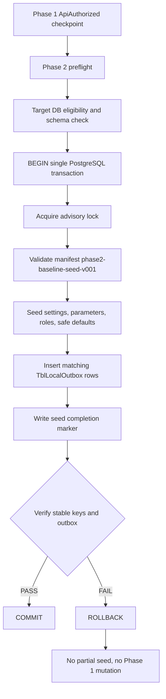

# Report 012 — Phase 2 Baseline Seed Read-Only Audit

## 1. Verdict

```text
BLOCKED_PHASE2_BASELINE_SEED_AUDIT
```

Reason: the requested reference PostgreSQL database `enailsalon_phasee1_pos1_pg` could not be inspected with a non-secret read-only credential during this run. The audit therefore cannot satisfy the prompt012 acceptance rule requiring live reference DB schema/count evidence.

This report records the completed read-only source/document audit and the exact blocker. It does not authorize Phase 2 implementation yet.

## 2. Phase 1 Freeze Verification

Checked presence only; raw checkpoint/JWT/credential content was not opened, printed, copied, rotated, deleted, or moved.

| Artifact | Path | Presence |
|---|---|---|
| ProductRoot | `E:\Project2026\_dev\WpfInstallationV0Phase1\WpfProductRoot` | Present |
| ApiAuthorized checkpoint | `E:\Project2026\_dev\WpfInstallationV0Phase1\WpfProductRoot\InstallationV0\Checkpoints\api-authorized.json` | Present |
| DPAPI bootstrap credential | `E:\Project2026\_dev\WpfInstallationV0Phase1\WpfProductRoot\InstallationV0\Secrets\bootstrap-credential.dpapi` | Present |
| Canonical two-phase contract | `E:\Project2026\CanonicalInstallationDocs\WPF-INSTALLATION-V0-TWO-PHASE-CONTRACT.md` | Present |

Phase 1 boundary status: preserved.

## 3. Reference Database Read-Only Proof

Reference DB requested:

```text
enailsalon_phasee1_pos1_pg
```

Read-only `psql` attempts were made using sanitized commands that did not include a password or connection string:

- `psql -h localhost -p 5432 -U postgres -d enailsalon_phasee1_pos1_pg ... BEGIN READ ONLY ... ROLLBACK`
- `psql -h localhost -p 5432 -U hung -d enailsalon_phasee1_pos1_pg ... BEGIN READ ONLY ... ROLLBACK`

Both attempts timed out waiting for a password. No password was requested in chat, entered by Codex, printed, logged, or persisted. Local pgpass checks did not find a usable non-secret credential file.

Result: live schema/table/count inspection is blocked.

## 4. Schema/Table Inventory

Live DB inventory: incomplete because database access is blocked.

Static EF model evidence from `E:\Project2026\4POS\NailSalonNet8\MyData\eNailSalonDbContext.cs` confirms active model/table mappings for these relevant groups:

| Table/entity | Static evidence | Preliminary role |
|---|---|---|
| `TblSystemBaselineVersion` | `SeedDb\SystemBaselineSeedService.cs` reads/writes `dbo."TblSystemBaselineVersion"` | Baseline marker candidate |
| `TblParameterSetting` | `DbSet<TblParameterSetting>` | Candidate system parameter table |
| `TblSetting` | `DbSet<TblSetting>` | Candidate app setting table |
| `TblSetupPrinter` | `DbSet<TblSetupPrinter>` | Candidate printer defaults |
| `TblSetupPaymentMethod` | `DbSet<TblSetupPaymentMethod>` | Candidate payment method defaults |
| `TblSetupLoginMethod` | `DbSet<TblSetupLoginMethod>` | Candidate login method defaults |
| `TblSetupWeird` | `DbSet<TblSetupWeird>` | Candidate setting for `IsRoundTipEnabled` |
| `TblSetupServicesMethod` | `DbSet<TblSetupServicesMethod>` | Candidate setting for `IsServiceSimple` |
| `TblEmployeePermission` | `DbSet<TblEmployeePermission>` | Candidate role/permission table |
| `TblTenant` | `DbSet<TblTenant>` | Phase 1 identity/local tenant reference candidate |
| `TblPosLocal` | `DbSet<TblPosLocal>` | Phase 1 POS identity/local station reference candidate |
| `TblLocalOutbox` | `DbSet<TblLocalOutbox>` | Same-transaction outbox requirement |
| `TblEmployee`, `TblServiceCategory`, `TblService`, `TblCustomer`, `TblGiftCard`, `TblInvoice`, `TblOutputInfo` | EF mappings present | Excluded from initial baseline unless operator later approves import |

Primary keys, FKs, unique constraints, defaults, and live row counts remain unverified pending DB access.

## 5. Candidate Classification A-F

This classification is provisional because live DB metadata is blocked.

| Group | Tables/concerns | Decision | Reason |
|---|---|---|---|
| Baseline marker | `TblSystemBaselineVersion` or V0 Phase 2 marker equivalent | A | Required to prove seed version/completion and idempotency. Existing service only marks system baseline version. |
| Application settings | `TblSetting`, `TblSetupWeird`, `TblSetupServicesMethod` | A | Contract and prior V02/V03 evidence require stable app settings such as `IsRoundTipEnabled` and `IsServiceSimple`. |
| System parameters | `TblParameterSetting` | A | Operator policy lists system parameters as mandatory candidates. Prior audit says legacy seed has only one parameter while reference DB had many. Exact baseline subset pending live DB evidence. |
| Printer defaults | `TblSetupPrinter` | C | Operator lists printer defaults, but machine/printer names are environment-specific and must not be blindly copied from reference DB. |
| Roles/permissions | `TblEmployeePermission` | A/B | Operator explicitly named `Owner`, `Admin`, `SubAdmin`. Exact table shape/row keys require live DB or source constant verification. |
| Payment/login defaults | `TblSetupPaymentMethod`, `TblSetupLoginMethod` | B | Likely required for safe UI/login/payment method opening, but exact row set must be confirmed against live DB. |
| Tenant/POS local identity | `TblTenant`, `TblPosLocal` | C | Phase 1 identity may need local rows for runtime identity, but values must come from Phase 1, not reference DB. |
| Runtime profile/state | Runtime profile tables if present | F | V0 Phase 2 contract does not yet settle runtime activation state. |
| Employees/staff | `TblEmployee`, employee working hour/capability tables | D | Operator policy says user-created/imported later. Do not seed staff in initial baseline. |
| Catalog | `TblServiceCategory`, `TblService`, `TblProduct` | D | Operator policy excludes services/categories from initial baseline. |
| Customers/gift cards | `TblCustomer*`, `TblGiftCard*` | D | Import later only; contains real business/customer data. |
| Transactions/history | `TblInvoice`, `TblOutputInfo*`, terminal payment info, booking/queue/payroll history | E | Runtime/transactional, explicitly excluded. |
| `TblLocalOutbox` | Outbox events for seed rows | A support table | Empty at start; Phase 2 writes matching events in same transaction only for rows inserted/updated by baseline seed. |

## 6. Safe Reference Row-Pattern Findings

No live row patterns were read from the reference database in this run.

Safe secondary evidence from `E:\Project2026\RecoveryReports\Cutover\PROMPT90A_WPF_CLEAN_DB_SEED_AUDIT.md` and `E:\Project2026\RecoveryReports\Cutover\WPF_CLEAN_DB_SEED_MANIFEST.md` indicates:

- legacy seed mixes placeholder tenant/POS, sample catalog, demo employees/customers, default settings, and outbox writes;
- legacy seed is table-level idempotent in many methods, not row-level manifest idempotent;
- prior audit treated employees, services, customers, gift cards, invoices, outputs, queue history, and payroll transactions as not part of a clean initial baseline;
- prior audit identified `TblParameterSetting` as a gap: legacy seed has too little parameter coverage compared with the reference DB.

These prior reports are secondary evidence only. They do not replace the missing prompt012 live DB readback.

## 7. WPF Seed Module Inventory

| Path | Class/type | Method | Current caller/call chain | Tables touched | Transaction behavior | Idempotency | Outbox behavior | Reuse decision |
|---|---|---|---|---|---|---|---|---|
| `E:\Project2026\4POS\NailSalonNet8\SeedDb\SystemBaselineSeedService.cs` | `SystemBaselineSeedService` | `ApplySystemBaselineAsOwnerAsync` | Called through `SeedDbProvider.RunSystemBaselineAsync` | `dbo."TblSystemBaselineVersion"` | Opens connection and transaction; commit after marker insert | `ON CONFLICT ("BaselineVersion") DO NOTHING` | None | Reuse concept, not sufficient for full Phase 2 |
| same | `SystemBaselineSeedService` | `VerifySystemBaselineAsync` | Startup/readiness callers | `TblSystemBaselineVersion` | Read-only verification query | Requires exactly one expected marker row | None | Reuse for marker verification with V0-specific contract review |
| `E:\Project2026\4POS\NailSalonNet8\SeedDb\BaselineReadinessCoordinator.cs` | `BaselineReadinessCoordinator` | `EnsureCheckedAsync` | Runtime baseline readiness | No direct table, delegates verification | In-flight/cached verification coordinator | Cached result | None | Useful pattern for read-side status only |
| `E:\Project2026\4POS\NailSalonNet8\SeedDb\SeedDbProvider.cs` | `SeedDbProvider` | `RunSystemBaselineAsync` | Production entry wrapper | Baseline marker only | Delegates to service transaction | Version marker idempotency | None | Too narrow for Phase 2 full seed |
| same | `SeedDbProvider` | `RunAllAsync` | Legacy manual/demo seed path | Many config, tenant, POS, catalog, employees, customers | One `ExecuteInTransactionAsync` around legacy flow | Mostly `AnyAsync()` table-level skips | Many `CreateLocalOutboxSingleAsync` calls | Obsolete; must not be canonical Phase 2 |
| same | `SeedDbProvider` | `RunLegacyDemoSeedAllAsync` | Explicit dev/test only | Same as above | One transaction wrapper | Mostly table-level | Many outbox events | Obsolete; development only |
| same | `SeedDbProvider` | `SeedTenantAsync`, `SeedPosAsync` | Legacy demo flow | `TblTenant`, `TblPosLocal` | Inside outer transaction | Partial/table/key checks | Tenant emits outbox; POS local does not | Refactor only if Phase 2 needs Phase 1 identity rows |
| same | `SeedDbProvider` | `SeedServiceCategoriesAsync`, `SeedServiceAsync`, `SeedCustomerAsync`, `SeedEmployeeAsync` | Legacy demo flow | Catalog/customer/staff | Inside outer transaction | Table-level | Emits outbox | Exclude from initial baseline |
| same | `SeedDbProvider` | `SeedEmployeePermissionAsync` | Legacy demo flow | `TblEmployeePermission` | Inside outer transaction | Table-level | Emits outbox | Possible row source, must refactor into manifest-stable roles only |
| same | `SeedDbProvider` | `SeedPaymentMethodsAsync`, `SeedParameterSetingAsync`, `SeedSetupPrinterAsync`, `SeedSetupLoginMethodAsync`, `SeedSetupWeirdAsync`, `SeedSetupServicesMethodAsync` | Legacy demo flow | Settings/parameters/printer/login | Inside outer transaction | Table-level | Emits outbox | Possible value hints, must refactor into canonical V0 manifest |
| same | `SeedDbProvider` | `SeedTurnSettingAsync` | Legacy demo flow | `TblTurnSetting` | Inside outer transaction | Table-level | No outbox in method | Conditional/likely defer unless operator approves |
| `E:\Project2026\4POS\NailSalonNet8\Services\Bootstrap\PostgresBootstrapFoundation.cs` | `PostgresBootstrapFoundation` | schema bootstrap helper | Prior docs say not wired into startup | Schema only | Unknown in this run | Not a seed idempotency owner | None | Schema prerequisite only, not Phase 2 baseline seed |
| `E:\Project2026\4POS\NailSalonNet8\InstallationV0\Infrastructure\Phase1InstallationService.cs` | `Phase1InstallationService` | Phase 1 authorization flow | InstallationV0 | No local POS DB by contract | N/A | N/A | N/A | Must stay Phase 1 only |

## 8. Seed Module Call-Chain Map

Static source and prior report evidence map the current legacy path as:

```text
Manual WPF setup action
-> SeedDbProvider.RunAllAsync()
-> env gate SPACEPOS_ALLOW_LEGACY_DEMO_SEED
-> RunLegacyDemoSeedAllAsync()
-> _mainServices.ExecuteInTransactionAsync(...)
-> SeedTenant / settings / permissions / catalog / employees / customers / defaults
-> many CreateLocalOutboxSingleAsync calls
```

Production-safe baseline marker path:

```text
SeedDbProvider.RunSystemBaselineAsync(connectionString)
-> SystemBaselineSeedService.ApplySystemBaselineAsOwnerAsync(connectionString)
-> transaction
-> insert dbo."TblSystemBaselineVersion" if absent
-> commit
```

Prompt012 finding: neither path is the desired Phase 2 owner as-is. The legacy path is too broad and demo-heavy; the baseline path is too narrow.

## 9. Duplicate/Conflict Matrix

| Seed concern | Module A | Module B | Same rows? | Conflict risk | Proposed canonical owner |
|---|---|---|---|---|---|
| Baseline completion | `SystemBaselineSeedService` | Future InstallationV0 Phase 2 | Marker overlap likely | Medium: V3-style marker may not represent V0 Phase 2 completion | InstallationV0 Phase 2 marker/manifest, optionally reusing marker table after review |
| Roles/permissions | `SeedEmployeePermissionAsync` | Future manifest | Likely same table | High: legacy row set may not match Owner/Admin/SubAdmin operator policy | InstallationV0 Phase 2 manifest |
| Parameters | `SeedParameterSetingAsync` | Future manifest | Same table | High: prior audit found legacy coverage too small | InstallationV0 Phase 2 manifest from audited keys |
| Printer defaults | `SeedSetupPrinterAsync` | Machine/operator config | Same table | High: machine-specific values must not be copied blindly | InstallationV0 Phase 2 with environment-safe defaults, operator binding later |
| Services/categories | `SeedService*` | Later import/setup | Same tables | High: demo catalog must not be baseline | Later user/import flow |
| Employees | `SeedEmployeeAsync` | Later manager/import flow | Same table | Critical: demo staff/PINs | Later user/import flow only |
| Customers/gift cards | `SeedCustomerAsync`, no gift-card seed | Later import | Same domain | Critical: real customer/business data | Later import only |
| Outbox | `CreateLocalOutboxSingleAsync` in legacy seed | Phase 2 required outbox | Same table | High: legacy outbox flood and non-deterministic payloads | Phase 2 deterministic outbox writer inside same transaction |

## 10. Source-of-Truth Comparison Matrix

| Concern | Reference DB pattern | Current WPF seed code | Current hard-coded/default value | Conflict | Proposed canonical source | Operator decision needed |
|---|---|---|---|---|---|---|
| Settings | Blocked live DB | Legacy setup methods | Mixed hard-coded defaults | Unknown exact key set | Versioned manifest | Yes, final keys |
| Parameters | Blocked live DB; prior audit says many rows | `SeedParameterSetingAsync` | Too small by prior audit | High | Versioned manifest from audited safe keys | Yes |
| Printer defaults | Blocked live DB | `SeedSetupPrinterAsync` | Machine-specific defaults | High | Manifest plus operator/machine binding | Yes |
| Roles | Blocked live DB | `SeedEmployeePermissionAsync` | Legacy role list | Medium/high | Manifest: Owner/Admin/SubAdmin plus approved permissions | Yes |
| Tenant/POS identity | Phase 1 checkpoint is source | Legacy seed generates new GUIDs | Placeholder/generated | Critical | Phase 1 identity | No, if contract already says exact Phase 1 identity |
| Outbox | Should start empty | Legacy seed writes many events | Non-canonical per-row legacy payloads | High | Deterministic Phase 2 outbox policy | Yes, payload contract |
| Seed version marker | `TblSystemBaselineVersion` exists in source | Baseline service writes V3-era version | `2026.07.15-system-baseline-v1` | Medium | `phase2-baseline-seed-v001` marker | Yes, marker table/name |

## 11. Proposed Canonical Baseline Table List

Do not implement from this list until DB access is resolved.

Proposed v001 candidates:

- Phase 2 seed marker table: `TblSystemBaselineVersion` or a new V0-specific marker after operator approval.
- `TblSetting`.
- `TblParameterSetting`.
- `TblSetupWeird`.
- `TblSetupServicesMethod`.
- `TblSetupLoginMethod`.
- `TblSetupPaymentMethod`.
- `TblSetupPrinter` with safe non-secret placeholders only.
- `TblEmployeePermission` for approved role/permission definitions.
- Optional/conditional: `TblTenant`, `TblPosLocal` only if normal WPF startup requires local identity rows immediately after Phase 2.

Target count remains under the operator's approximate 30-table goal, but exact list must be finalized from live DB metadata.

## 12. Explicit Excluded Table List

Initial Phase 2 baseline must not seed:

- `TblEmployee` and staff/private employee rows.
- `TblServiceCategory`, `TblService`, `TblProduct` unless a later operator-approved catalog baseline changes policy.
- `TblCustomer`, `TblCustomerCategory`, `TblCustomerInfo`, customer loyalty/history.
- `TblGiftCard`, `TblGiftCardInfo`.
- `TblInvoice`, `TblInvoiceBookingLink`.
- `TblOutputInfo`, `TblOutputInfoTam`, `TblTempOutputInfo`.
- terminal payment/runtime transaction tables.
- bookings/appointments and queue/turn runtime history.
- payroll transactions/history.
- diagnostics/log/event-delivery operational rows.
- pairing codes, device registration, permanent enrollment, secrets, tokens, or credentials.

## 13. FK/Dependency Order

Provisional ordered list:

1. Verify Phase 1 checkpoint and protected credential readback before opening Phase 2.
2. Verify target DB eligibility and schema prerequisite.
3. Begin one PostgreSQL transaction.
4. Acquire seed lock/advisory lock.
5. Upsert global/settings lookup rows without FK dependencies.
6. Upsert role/permission definitions.
7. Upsert payment/login/system defaults.
8. Upsert conditional tenant/POS identity rows only if approved.
9. Insert deterministic `TblLocalOutbox` rows for every inserted/updated baseline row.
10. Write Phase 2 seed marker last.
11. Verify rows and outbox mappings inside the same transaction.
12. Commit.

FK order must be recalculated after live DB metadata is available.

## 14. One-Transaction Design

Required transaction boundary:

```text
BEGIN
  verify Phase 1 ApiAuthorized checkpoint identity
  verify protected WpfJwt reference exists; do not redeem Pairing Code
  verify target database is eligible and schema-complete
  acquire PostgreSQL advisory lock for InstallationV0 Phase2
  load phase2-baseline-seed-v001 manifest
  validate manifest checksum/version
  upsert approved baseline rows by stable keys
  for each changed row, add one deterministic TblLocalOutbox event
  write baseline seed marker last
  verify required stable keys and outbox rows
COMMIT
```

Failure behavior:

```text
ROLLBACK
do not mutate Phase 1 checkpoint
do not mark Phase 2 complete
do not leave partial seed or partial outbox
```

Schema/migrations are a prerequisite outside this seed transaction unless a later prompt explicitly defines a schema transaction. Prompt012 did not authorize schema creation or migration.

## 15. Idempotency, Version, Rollback, Retry, Concurrency

| Concern | Proposed rule |
|---|---|
| Manifest version | `phase2-baseline-seed-v001` |
| Stable keys | Table-specific natural key or explicit `SeedKey`; never random GUID alone |
| First run | Insert missing baseline rows and matching outbox `I` rows |
| Same-version replay | If rows and marker match, return idempotent success with no new outbox |
| Changed row within same version | Treat as conflict unless manifest checksum changed under approved revision |
| Partial rows without marker | Block with recovery-required classification; do not auto-merge silently |
| Conflicting rows | Block and show table/key conflict |
| Newer marker | Block older installer |
| Retry after rollback | Safe to rerun with same manifest and same Phase 1 identity |
| Concurrency | PostgreSQL advisory transaction lock plus marker uniqueness |

## 16. TblLocalOutbox Policy

`TblLocalOutbox` starts empty for a clean installation. Phase 2 writes outbox rows only for actual baseline row inserts/updates that must synchronize upstream.

Outbox row minimum contract:

- tenant identity from Phase 1/local tenant row;
- source client/POS identity from Phase 1/local POS row;
- table/entity name;
- stable entity key or entity GUID;
- operation `I` or `U`;
- deterministic sanitized payload JSON;
- occurred time UTC;
- pending status;
- `SeedBatchGuid`;
- manifest version and contract version.

No outbox payload may contain passwords, tokens, pairing codes, terminal secrets, or private customer/employee data.

Open issue: existing `CreateLocalOutboxSingleAsync` may be reusable only after proving its payload shape is deterministic, sanitized, and usable inside the same explicit Phase 2 transaction.

## 17. Seed Manifest v001 Proposal

```text
version: phase2-baseline-seed-v001
identitySource: Phase 1 ApiAuthorized checkpoint
valueSource: approved InstallationV0 manifest, not raw reference DB rows
candidateTables:
  - TblSetting
  - TblParameterSetting
  - TblSetupWeird
  - TblSetupServicesMethod
  - TblSetupLoginMethod
  - TblSetupPaymentMethod
  - TblSetupPrinter
  - TblEmployeePermission
  - TblSystemBaselineVersion or V0 marker
conditionalTables:
  - TblTenant
  - TblPosLocal
outboxPolicy: one matching outbox per changed baseline row in same transaction
idempotencyKey: manifestVersion + tableName + stableKey + normalizedValueHash
excludedTables:
  - employees/staff
  - service catalog
  - customers
  - gift cards
  - invoices/payments/bookings/output
  - queue/turn/payroll runtime history
verificationRule: physical readback by stable keys after commit
```

No implementation manifest was created or committed.

## 18. Mermaid Transaction Flow



## 19. Operator Decisions Still Required

1. Provide a safe read-only way to inspect `enailsalon_phasee1_pos1_pg` without exposing secrets.
2. Approve exact Phase 2 marker table/name and version key.
3. Approve final role/permission rows for `Owner`, `Admin`, `SubAdmin`.
4. Decide whether printer rows are seeded as placeholders or deferred to machine binding.
5. Decide whether local `TblTenant`/`TblPosLocal` rows are mandatory in Phase 2 v001.
6. Approve deterministic `TblLocalOutbox` payload contract or require a new writer.

## 20. Exact Implementation Scope for Prompt013

Prompt013 should not implement Phase 2 until the DB blocker is resolved. The next safe prompt should:

- run live read-only schema/count/key audit using approved non-secret credential handling;
- produce the finalized candidate table list with PK/FK/default/non-null metadata;
- finalize the manifest row keys and expected counts;
- then, in a later operator-approved implementation prompt, add InstallationV0 Phase 2 code.

## 21. No Mutation Confirmation

Confirmed for this prompt012 run:

- no source files under `E:\Project2026` were modified;
- no database rows/schema were created, updated, deleted, migrated, seeded, or exported;
- no WPF/API/Platform runtime processes were stopped or restarted;
- no build/test was run;
- no Phase 1 ProductRoot/checkpoint/DPAPI credential was changed;
- no secrets, passwords, tokens, pairing codes, or customer/private data were added to this report.

## 22. Local-Only Evidence Paths/Hashes

No local-only detailed DB evidence files were created because live DB access was blocked before any schema/count export could be produced.

## 23. Coordination Commit SHA

Pending at report creation time; final response will include the commit SHA after commit and push.
