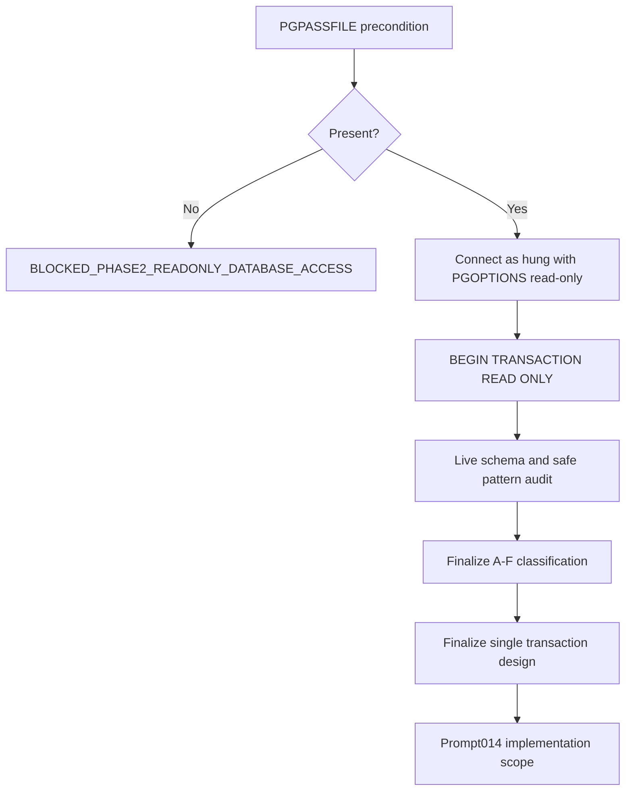

# Report 013 — Phase 2 Live Read-Only Baseline Seed Audit

## 1. Verdict

```text
BLOCKED_PHASE2_READONLY_DATABASE_ACCESS
```

Prompt013 could not proceed to live PostgreSQL inspection because the required operator-prepared `PGPASSFILE` environment variable was not present in the Codex process.

No fallback to `postgres` or administrator credentials was attempted.

## 2. PGPASSFILE Precondition Evidence

Prompt013 credential boundary required:

```text
PGPASSFILE environment variable present = true
Referenced file exists = true
File content = NEVER READ / NEVER PRINT
```

Observed safely:

| Check | Result |
|---|---|
| `PGPASSFILE` environment variable present | `False` |
| Referenced file exists | `NotChecked` |
| File content read | `Never read` |
| Full secret file path printed | `No` |
| Credential file copied or committed | `No` |

Because `PGPASSFILE` was absent, the required `hung` role connection could not be made under the approved non-secret credential path.

## 3. Read-Only Transaction Proof

Not executed.

Reason: prompt013 explicitly requires blocking with `BLOCKED_PHASE2_READONLY_DATABASE_ACCESS` when `PGPASSFILE` is absent. No `psql` session was opened for `enailsalon_phasee1_pos1_pg` in this run.

Required proof remains pending:

```text
transaction_read_only = on
current_database = enailsalon_phasee1_pos1_pg
current_user = hung
```

## 4. Role `hung` Privilege / Read-Only Proof

Not executed.

The prompt forbids fallback to administrator credentials and forbids changing privileges. Since `PGPASSFILE` was not available, Codex did not test role `hung` against the database.

## 5. Live Schema/Table/Row-Count Inventory

Blocked by missing read-only database access.

No live row counts, PK/FK metadata, index metadata, defaults, server constraints, or safe row patterns were read from `enailsalon_phasee1_pos1_pg` during prompt013.

Candidate table set still requiring live inspection:

```text
TblSystemBaselineVersion
TblSetting
TblParameterSetting
TblSetupWeird
TblSetupServicesMethod
TblSetupLoginMethod
TblSetupPaymentMethod
TblSetupPrinter
TblEmployeePermission
TblTenant
TblPosLocal
TblLocalOutbox
TblTurnSetting
```

Excluded groups also remain unverified by live count in prompt013.

## 6. PK/FK/Unique/Default/Non-Null Metadata

Blocked by missing read-only database access.

Static source evidence from `report/report012.md` remains the latest available evidence, but prompt013 requires live PostgreSQL metadata before finalizing Phase 2.

## 7. Final A-F Classification

Not final.

Prompt013 requires that no classification remain provisional after live DB inspection. Since live inspection did not start, the final classification cannot be responsibly closed.

Current state:

| Category | Status |
|---|---|
| A. Mandatory baseline seed | Pending live DB metadata |
| B. Required lookup/reference seed | Pending live DB metadata |
| C. Conditional plan/machine seed | Pending live DB metadata |
| D. User-created/imported later | Policy known, live counts pending |
| E. Runtime/transactional excluded | Policy known, live counts pending |
| F. Deferred | Active due missing DB access |

## 8. Safe Candidate Row-Pattern Findings

Blocked by missing read-only database access.

No live safe key names, boolean/numeric defaults, enum/code labels, scope patterns, printer row shapes, role rows, or parameter/settings row patterns were read.

No customer, employee, invoice, gift-card, booking, payment, output, terminal, token, password, or credential data was read or reported.

## 9. Source-to-Live Module Comparison

Cannot be completed without live schema evidence.

The source-only baseline from `report/report012.md` remains:

- `SystemBaselineSeedService` is narrow and only handles `TblSystemBaselineVersion`.
- `SeedDbProvider.RunAllAsync` / `RunLegacyDemoSeedAllAsync` are legacy mixed/demo seed paths guarded by `SPACEPOS_ALLOW_LEGACY_DEMO_SEED`.
- Legacy seed includes settings/parameters/printers/roles plus demo tenant/catalog/employees/customers and many outbox writes.
- Prompt013 still must compare those methods against live schema before a Phase 2 implementation prompt.

## 10. Duplicate / Conflict / Coverage-Gap Conclusions

Not final.

Known from report012 source/document audit:

- `SeedParameterSetingAsync` likely has a coverage gap.
- `SeedEmployeePermissionAsync` requires role compatibility validation for `Owner`, `Admin`, `SubAdmin`.
- `SeedSetupPrinterAsync` has machine-specific risk.
- `TblSystemBaselineVersion` suitability for V0 Phase 2 marker is unresolved.
- `TblTenant` / `TblPosLocal` mapping must be driven by Phase 1 identity, not copied from the reference DB.
- `CreateLocalOutboxSingleAsync` payload compatibility remains unresolved.

Prompt013 could not close these because live DB access was unavailable.

## 11. Final Canonical Baseline Table List

Not finalized.

The provisional list from report012 remains the only safe planning list:

```text
TblSetting
TblParameterSetting
TblSetupWeird
TblSetupServicesMethod
TblSetupLoginMethod
TblSetupPaymentMethod
TblSetupPrinter
TblEmployeePermission
TblSystemBaselineVersion or V0 marker
Conditional: TblTenant, TblPosLocal
Support: TblLocalOutbox
```

This list must not be treated as implementation-ready until live metadata inspection succeeds.

## 12. Explicit Exclusions

Policy exclusions remain intact from prompt012 and the canonical two-phase contract:

```text
employees/staff
service categories
services
customers
gift cards
bookings/appointments
invoices
TblOutputInfo and related runtime output tables
terminal payment/runtime transaction tables
turn/runtime state/history tables
event/delivery operational data
payroll transactions
Pairing Code / WpfJwt / secret / credential data
```

Live existence/count confirmation remains pending.

## 13. Exact FK Insert Order

Not final.

Prompt013 requires live FK/constraint inspection before exact insert order can be sealed. Using the provisional report012 order for implementation would be unsafe.

## 14. Final One-Transaction Design

Not final, but the contract remains:

```text
Phase 1 prerequisite revalidation
Target DB eligibility/schema prerequisite
Acquire PostgreSQL advisory transaction lock
BEGIN one transaction
Validate seed manifest/version
Insert/upsert canonical rows in exact FK order
Insert deterministic TblLocalOutbox rows in same transaction
Write Phase 2 completion marker last
Read back stable keys/counts/invariants
COMMIT
```

Failure behavior remains:

```text
ROLLBACK all baseline rows
ROLLBACK all outbox rows
ROLLBACK marker
Phase 1 checkpoint unchanged
Phase 2 remains NotStarted/FailedRetryable
```

The exact table order, marker table, idempotency keys, and outbox payload contract remain blocked pending live DB audit.

## 15. Idempotency / Version / Rollback / Retry / Concurrency Policy

Not final.

The provisional policy from report012 remains directionally valid but cannot be sealed:

- manifest version proposal: `phase2-baseline-seed-v001`;
- row-level stable keys required;
- same-version replay must not duplicate rows or outbox events;
- partial rows without marker must block for recovery;
- newer version must block older installer;
- advisory transaction lock required;
- rollback must include seed rows, outbox rows, and marker.

## 16. Final `TblLocalOutbox` Policy

Not final.

Unresolved until live schema and payload compatibility are inspected:

- exact required columns;
- deterministic idempotency key;
- payload shape;
- whether existing `CreateLocalOutboxSingleAsync` is safe to reuse;
- which baseline rows require outbox events.

Hard rule remains: no seed row without matching outbox if the row is part of the approved sync contract; no outbox without the corresponding seed row in the same transaction.

## 17. `phase2-baseline-seed-v001` Manifest Proposal

Not implementation-ready.

The manifest proposal remains blocked from finalization because prompt013 could not inspect live table metadata and safe row patterns.

No implementation manifest was created in WPF source.

## 18. Mermaid Flow / DAG



## 19. Remaining Operator Decisions

Immediate decision:

1. Restart Codex with `PGPASSFILE` set to an operator-created local secret file for role `hung`.

Still pending after DB access works:

2. Approve final marker table/version key.
3. Approve final role/permission rows.
4. Approve printer placeholder versus later machine binding.
5. Approve whether `TblTenant` / `TblPosLocal` are seeded in Phase 2 v001.
6. Approve or replace `TblLocalOutbox` payload writer.

## 20. Exact Implementation Scope for Prompt014

Prompt014 should not implement Phase 2 yet unless it first receives the completed live DB audit from a successful prompt013 rerun.

Next safe task:

```text
Rerun prompt013 after PGPASSFILE is present and readable by psql without Codex opening the file.
```

Only after a PASS report should prompt014 implement InstallationV0 Phase 2.

## 21. Phase 1 Freeze Proof

Presence-only checks:

| Artifact | Result |
|---|---|
| `E:\Project2026\_dev\WpfInstallationV0Phase1\WpfProductRoot` | Present |
| `InstallationV0\Checkpoints\api-authorized.json` | Present |
| `InstallationV0\Secrets\bootstrap-credential.dpapi` | Present |

No raw checkpoint content, token, credential, Pairing Code, or protected secret was opened, printed, copied, rotated, deleted, or overwritten.

## 22. No Mutation Confirmation

Confirmed:

- no DB connection was opened;
- no SQL was executed against `enailsalon_phasee1_pos1_pg`;
- no database/schema/table/row/sequence/privilege was modified;
- no source under `E:\Project2026` was modified;
- no WPF/API/Platform runtime process was stopped or restarted;
- no build/test/migration/seed was run;
- no Phase 1 ProductRoot/checkpoint/DPAPI credential was changed;
- no secrets or private business data were committed.

## 23. Local Evidence Folder / File Hashes

No local-only evidence folder was created.

Reason: prompt013 blocked before DB audit could start because `PGPASSFILE` was absent. Creating empty evidence artifacts would not add useful evidence and could confuse provenance.

Required future folder after access is available:

```text
E:\Project2026\RecoveryReports\InstallationV0\Phase2SeedAuditV002\
```

## 24. Coordination Commit SHA

Pending at report creation time. Final response will include the commit SHA after commit and push.
