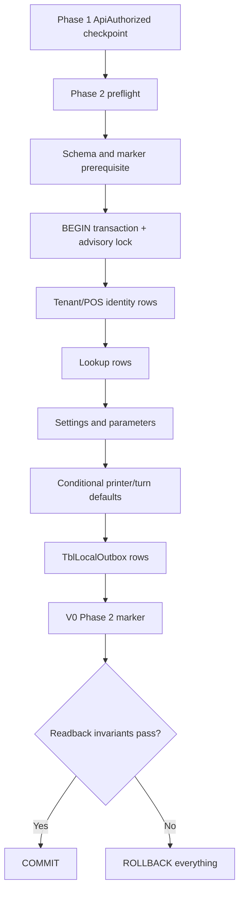

# Report 014 — Phase 2 Live DB Audit by Fixed Local PGPASS Path

## 1. Verdict

```text
PHASE2_BASELINE_SEED_AUDIT_READY_FOR_IMPLEMENTATION_PROMPT
```

Prompt014 completed the missing live PostgreSQL read-only audit for `enailsalon_phasee1_pos1_pg` using role `hung`. Phase 2 seed was not implemented.

## 2. Fixed Local Pgpass Resolution Proof

| Check | Result |
|---|---|
| Fixed local pgpass path resolved | `true` |
| Credential file exists | `true` |
| `PGPASSFILE` set process-local only | `true` |
| Pgpass content read/printed/copied/hashed | `false` |
| Full pgpass path disclosed in report | `false` |
| Fallback to `postgres` or admin role | `false` |

## 3. Read-Only Transaction Proof

Evidence file: `READONLY-PROOF.txt`

Observed inside the SQL batch:

| Proof | Result |
|---|---|
| `transaction_read_only` | `on` |
| `current_database` | `enailsalon_phasee1_pos1_pg` |
| `current_user` | `hung` |

All audit batches used `BEGIN TRANSACTION READ ONLY`, `SET LOCAL statement_timeout = '30s'`, SELECT-only statements, and `ROLLBACK`.

## 4. Live Schema / Table / Count Inventory

Physical schema for candidate tables: `dbo`.

| Table | Exists | Exact count | Classification |
|---|---:|---:|---|
| `TblSystemBaselineVersion` | No | 0 | F |
| `TblSetting` | Yes | 0 | F |
| `TblParameterSetting` | Yes | 110 | A/C |
| `TblSetupWeird` | Yes | 1 | A |
| `TblSetupServicesMethod` | Yes | 1 | A |
| `TblSetupLoginMethod` | Yes | 3 | B |
| `TblSetupPaymentMethod` | Yes | 6 | B |
| `TblSetupPrinter` | Yes | 5 | C |
| `TblEmployeePermission` | Yes | 7 | B |
| `TblTenant` | Yes | 1 | C |
| `TblPosLocal` | Yes | 16 | C |
| `TblLocalOutbox` | Yes | 16012 | A support table, target starts empty |
| `TblTurnSetting` | Yes | 4 | C |

Excluded group counts were collected without reading business rows. Examples: `TblEmployee` 20, `TblServiceCategory` 18, `TblService` 158, `TblCustomer` 6430, `TblGiftCard` 279, `TblGiftCardInfo` 282, `TblInvoice` 148, `TblOutputInfo` 196, terminal payment/runtime tables present, queue/turn runtime rows present.

## 5. Candidate Metadata Summary

Primary keys:

| Table | Primary key / stable constraint |
|---|---|
| `TblEmployeePermission` | PK `EmployeePermissionGuid`; unique `PermissionName` |
| `TblLocalOutbox` | PK `OutboxId`; index on `Sent`, `Processor`, `CreatedAt` |
| `TblParameterSetting` | PK `ParameterSettingGuid`; no unique key on `PropertyName` |
| `TblPosLocal` | PK `PosGuid`; index on `TenantGuid`, `IsActive` |
| `TblSetting` | PK `SettingGuid` |
| `TblSetupLoginMethod` | PK `SetupLoginMethodGuid`; unique `LoginMethodName` |
| `TblSetupPaymentMethod` | PK `SetupPaymentMethodGuid` |
| `TblSetupPrinter` | PK `SetupPrinterGuid` |
| `TblSetupServicesMethod` | PK `SetupServicesMethodGuid` |
| `TblSetupWeird` | PK `SetupWeirdGuid` |
| `TblTenant` | PK `TenantGuid`; unique `TenantCode` |
| `TblTurnSetting` | PK `TurnSettingGuid` |

Candidate FK dependency evidence is empty: the candidate seed tables audited do not expose direct foreign-key rows in `fk-dependency.tsv`. Insert order can therefore be driven by logical identity dependencies rather than FK constraints.

## 6. Safe Row-Pattern Findings

Safe stable key evidence:

| Table | Stable key | Safe finding |
|---|---|---|
| `TblParameterSetting` | `PropertyName` | 110 physical rows, 109 non-sensitive key rows after redaction filter; repeated feature/check-in keys exist, so v001 must seed only an approved manifest subset. |
| `TblSetupLoginMethod` | `LoginMethodName` | 3 labels: `Login-Smart`, `Login-With-Password`, `No-Login`. |
| `TblSetupPaymentMethod` | `PaymentName` | 6 labels: cash, coupon, credit card, checks, gift-card payment, membership payment. |
| `TblEmployeePermission` | `PermissionName` | 7 labels including `Owner`, `Admin`, `Sub_Manager`, `Manager`, `Staff`, `AI_Assistant`, `VirtualAnyTechnician`. |
| `TblSetupWeird` | singleton per Tenant | `IsRoundTipEnabled` column exists and is non-null. |
| `TblSetupServicesMethod` | singleton per Tenant | `IsServiceSimple` column exists and is non-null. |
| `TblSetupPrinter` | `PrinterType` plus Tenant | Shape confirmed; physical printer names/paths are machine-binding-later fields. |

No raw customer, employee, gift-card, invoice, payment, booking, output, terminal credential, token, password, or Pairing Code values were exported.

## 7. Final A-F Classification

| Table / concern | Final group | Stable row key | Expected v001 behavior |
|---|---|---|---|
| V0 Phase 2 marker | A | `phase2-baseline-seed-v001` | Create/verify a V0 marker schema prerequisite; do not reuse absent `TblSystemBaselineVersion`. |
| `TblParameterSetting` | A/C | `PropertyName` plus scope | Seed approved mandatory keys only; defer duplicated/environment-specific gateway keys. |
| `TblSetupWeird` | A | Tenant singleton | Seed 1 row from manifest/Phase 1 Tenant identity. |
| `TblSetupServicesMethod` | A | Tenant singleton | Seed 1 row from manifest/Phase 1 Tenant identity. |
| `TblSetupLoginMethod` | B | `LoginMethodName` | Seed 3 lookup rows. |
| `TblSetupPaymentMethod` | B | `PaymentName` | Seed 6 lookup rows. |
| `TblEmployeePermission` | B | `PermissionName` | Seed role/permission labels; represent SubAdmin as physical `Sub_Manager` unless operator requests a new label. |
| `TblSetupPrinter` | C | `PrinterType` plus Tenant | Seed placeholder-safe rows only; bind printer names/paths later. |
| `TblTenant` | C | Phase 1 `TenantGuid` / `TenantCode` | Seed local identity row from Phase 1, with sensitive/private fields empty or protected by later setup. |
| `TblPosLocal` | C | Phase 1 `PosGuid` / POS name | Seed one local POS row from Phase 1; do not copy 16 reference stations. |
| `TblTurnSetting` | C | Manifest-defined scenario key | Seed only if operator wants initial turn defaults in v001. |
| `TblSetting` | F | `SettingName` | Present but empty in reference DB; no v001 seed until a concrete required setting exists. |
| Employees/staff | D | N/A | User/import later. |
| Catalog/services/products | D | N/A | User/import later. |
| Customers/gift cards | D | N/A | Import later; not baseline. |
| Invoices/payments/bookings/output/queue/payroll/history | E | N/A | Runtime/transactional excluded. |

## 8. Source-to-Live Comparison

| Concern | Live evidence | Existing WPF source | Conclusion |
|---|---|---|---|
| Baseline marker | `TblSystemBaselineVersion` absent | `SystemBaselineSeedService` writes that table | Do not reuse as-is. Prompt015 should introduce V0 marker schema/contract. |
| Parameters | `TblParameterSetting` has 110 rows and no unique key on `PropertyName` | `SeedParameterSetingAsync` is legacy and undercovers reference DB | Build manifest subset with explicit idempotency key; legacy method is not enough. |
| Roles | `TblEmployeePermission` has unique `PermissionName` | `SeedEmployeePermissionAsync` legacy seed | Reuse labels as reference, refactor into manifest row writer. |
| Printers | `TblSetupPrinter` has required printer type/name/path shape | `SeedSetupPrinterAsync` seeds machine-specific defaults | Seed placeholders only, bind physical printer details later. |
| Login/payment | Required lookup tables present | Legacy setup methods seed them | Good candidates for B lookup seed with stable keys. |
| Tenant/POS | Reference has 1 tenant and 16 POS rows | Legacy seed generates identities | Target must use Phase 1 identities, not reference identity copy. |
| Outbox | `TblLocalOutbox` exists and has many reference rows | Legacy seed writes many outbox events | New target starts empty; Phase 2 writes deterministic outbox only for baseline changes. |

## 9. Coverage-Gap / Conflict Conclusions

- `SeedParameterSetingAsync` coverage is not acceptable for Phase 2 v001; reference shows many key rows and duplicates by key/scope.
- `SeedEmployeePermissionAsync` is compatible only after filtering to approved role/permission labels.
- `SeedSetupPrinterAsync` is unsafe as a copy source because physical binding values are machine-specific.
- `SeedPaymentMethodsAsync` and `SeedSetupLoginMethodAsync` are required lookup candidates.
- `TblSystemBaselineVersion` is not present physically in the reference DB, so V0 Phase 2 needs its own marker schema.
- `TblTenant` and `TblPosLocal` are needed as conditional identity rows, sourced from Phase 1.
- `CreateLocalOutboxSingleAsync` may be reused only if prompt015 proves deterministic payloads and same-transaction use; otherwise create a Phase 2-specific outbox writer.

## 10. Final Canonical Baseline List

`phase2-baseline-seed-v001` should include:

- V0 Phase 2 seed marker table/row.
- `TblTenant` one row from Phase 1 identity.
- `TblPosLocal` one POS row from Phase 1 identity.
- `TblSetupWeird` one row.
- `TblSetupServicesMethod` one row.
- `TblSetupLoginMethod` three lookup rows.
- `TblSetupPaymentMethod` six lookup rows.
- `TblEmployeePermission` approved role/permission rows.
- `TblParameterSetting` approved mandatory keys only.
- `TblSetupPrinter` placeholder-safe rows only.
- Optional `TblTurnSetting` four rows only if operator approves turn defaults for v001.
- `TblLocalOutbox` matching rows for every inserted/updated baseline row.

## 11. Explicit Exclusions

Do not seed in Phase 2 v001:

- employees/staff and PINs;
- service categories, services, products/catalog;
- customers, customer check-in history/devices/tickets;
- gift cards and gift-card ledger;
- invoices, invoice booking links, output/payment rows;
- terminal payment transactions or credentials;
- booking/appointment rows;
- queue/turn/payroll runtime history;
- old `TblLocalOutbox` rows from reference DB;
- pairing codes, WpfJwt, device registration, PlatformEnrollment, or any secret.

## 12. Exact FK / Logical Insert Order

Because candidate FK metadata is empty, use this logical order:

1. Revalidate Phase 1 `ApiAuthorized` proof and local identity.
2. Verify target schema and V0 marker schema prerequisite.
3. Begin one transaction and acquire `pg_advisory_xact_lock`.
4. Upsert `TblTenant` from Phase 1 identity if absent.
5. Upsert `TblPosLocal` for Phase 1 POS if absent.
6. Upsert lookup rows: `TblSetupLoginMethod`, `TblSetupPaymentMethod`, `TblEmployeePermission`.
7. Upsert singleton settings: `TblSetupWeird`, `TblSetupServicesMethod`.
8. Upsert approved `TblParameterSetting` rows.
9. Upsert placeholder-safe `TblSetupPrinter` rows if approved.
10. Upsert optional `TblTurnSetting` rows if approved.
11. Insert deterministic `TblLocalOutbox` rows for actual changes.
12. Write V0 Phase 2 marker last.
13. Read back stable keys/counts/invariants inside transaction.
14. Commit.

## 13. Final One-Transaction Design

```text
Revalidate Phase 1 prerequisite
Verify target DB schema/eligibility
Acquire pg_advisory_xact_lock(hash('InstallationV0:Phase2:TenantGuid:PosGuid'))
BEGIN one transaction
Validate phase2-baseline-seed-v001 state
Insert/upsert canonical rows in logical order
Insert deterministic TblLocalOutbox rows in same transaction
Write V0 Phase 2 completion marker last
Readback stable keys/counts/invariants
COMMIT
```

Failure:

```text
ROLLBACK baseline rows
ROLLBACK outbox rows
ROLLBACK marker
Phase 1 checkpoint unchanged
Phase 2 not complete
```

Schema/migration boundary: schema creation/migration is a prerequisite before the seed transaction. The seed transaction should not silently create the full POS schema. The V0 marker table must be introduced by the approved schema/migration path before or as an explicit schema prerequisite step, not by legacy seed.

## 14. Idempotency / Version / Rollback / Retry / Concurrency

| State | Required behavior |
|---|---|
| Empty target DB with schema ready | Insert manifest rows, outbox, marker, commit. |
| Same version complete | Verify rows and marker; return idempotent success, no duplicate rows/outbox. |
| Partial rows without marker | Block as recovery-required; no blind merge. |
| Conflicting rows | Block with table/stable-key conflict. |
| Newer marker present | Block older installer. |
| Retry after rollback | Safe with same Phase 1 identity and manifest version. |
| Second instance | Advisory transaction lock serializes; loser waits/fails retryable. |

Idempotency key: `manifestVersion + tableName + stableKey + normalizedValueHash`.

## 15. Final TblLocalOutbox Policy

`TblLocalOutbox` schema exists with required columns including tenant, event, transaction, source client, entity, operation, payload, processor/status, timestamps, and attempt counters. The reference DB contains historical outbox rows; none should be copied.

Phase 2 policy:

- target begins with no baseline outbox rows;
- one outbox event per inserted/updated baseline row;
- no outbox for no-op/idempotent replay;
- same `SeedBatchGuid`/transaction guid for one seed run;
- `SourceClientId` derived from Phase 1 POS/local identity;
- payload deterministic and sanitized;
- no password, token, credential, terminal secret, customer data, employee private data, or reference row dump.

## 16. Final Manifest Proposal

```text
version: phase2-baseline-seed-v001
identitySource: Phase 1 ApiAuthorized checkpoint
valueSource: approved InstallationV0 manifest, not raw reference DB rows
marker: dbo.TblInstallationV0Phase2SeedVersion (schema prerequisite)
requiredTables:
  - TblTenant
  - TblPosLocal
  - TblSetupWeird
  - TblSetupServicesMethod
  - TblSetupLoginMethod
  - TblSetupPaymentMethod
  - TblEmployeePermission
  - TblParameterSetting
conditionalTables:
  - TblSetupPrinter
  - TblTurnSetting
supportTables:
  - TblLocalOutbox
excludedTables:
  - employees/staff
  - service catalog
  - customers
  - gift cards
  - invoices/payments/bookings/output
  - terminal/queue/turn/payroll runtime history
verification:
  - stable key readback
  - outbox mapping readback
  - marker readback
```

No implementation manifest was created in WPF source.

## 17. Mermaid Flow



## 18. Operator Decisions Still Required

- Approve marker schema name proposed above or provide another exact marker table.
- Confirm `Sub_Manager` is the physical representation of requested `SubAdmin`.
- Confirm whether `TblSetupPrinter` placeholder rows are in v001 or deferred entirely.
- Confirm whether `TblTurnSetting` is included in v001.
- Approve deterministic outbox writer reuse or require a new InstallationV0 Phase 2 writer.

## 19. Exact Implementation Scope for Prompt015

Prompt015 may implement InstallationV0 Phase 2 only within the existing rules:

- no Phase 1 rewrite;
- no reference DB mutation;
- create/use V0 marker schema through approved schema prerequisite;
- implement manifest `phase2-baseline-seed-v001`;
- implement one transaction with advisory lock;
- seed only approved A/B/C rows;
- write `TblLocalOutbox` in the same transaction;
- physical readback and idempotent replay tests;
- no employees/catalog/customers/gift cards/invoices/runtime history.

## 20. Phase 1 Freeze Proof

Presence-only checks passed:

| Artifact | Result |
|---|---|
| ProductRoot | Present |
| ApiAuthorized checkpoint | Present |
| DPAPI-protected bootstrap credential | Present |

No raw checkpoint, WpfJwt, Pairing Code, credential, or secret was opened or printed.

## 21. No Mutation / Source / Runtime Change Proof

Confirmed:

- PostgreSQL audit used role `hung`, read-only transaction, and rollback.
- No `INSERT`, `UPDATE`, `DELETE`, `ALTER`, `CREATE`, `DROP`, migration, seed, `nextval`, `setval`, `VACUUM`, or privilege mutation was run.
- No source under `E:\Project2026` was modified.
- No runtime process was stopped/restarted.
- No build/test was run.
- No ProductRoot/checkpoint/DPAPI credential was changed.
- Public report contains no pgpass path, password, connection string, token, Pairing Code, or business row dump.

## 22. Local Evidence V003

Local-only evidence folder:

```text
E:\Project2026\RecoveryReports\InstallationV0\Phase2SeedAuditV003\
```

File hashes:

```text
4130E238B400CAB9F5B2AAB269DB7F72080DB3BF49325E4046556ABBD40430B5  AUDIT-MANIFEST.json
BB34F39EC3F98849394586D243D2D5222C984F1C1DA88D71C7FB7587F708EBFC  candidate-table-counts.tsv
CE3C13EC14D7D3A3CF0B726D042DEA3F4CE1F089FA99EAFF27DF7B82E7733D0A  constraints.tsv
98DFF7FE49E59E8BEBED62C302FDD33076D5254BDFFCEF2A95F08C09368E258A  fk-dependency.tsv
6B53F32CE45465E03AA8D9332E9668F71439A56B509BF1446F860691F2B7B99E  READONLY-PROOF.txt
C8E4866A6356E7CABBF5826ED7C85ADCDD8B57FEFE80C71CA438D429D2439CC6  safe-candidate-patterns.tsv
8C06DC963A15B182E4918BD918EA0E6095FAA3F578A15E1138311075D6916E28  schema-metadata.tsv
410C0D76D108E2E3D5C6E7CB6317378BA9C728217DC139EA4A6F0ECED933CC88  source-live-comparison.md
```

## 23. Coordination Commit SHA

Pending at report creation time. Final response will include the commit SHA after commit and push.
